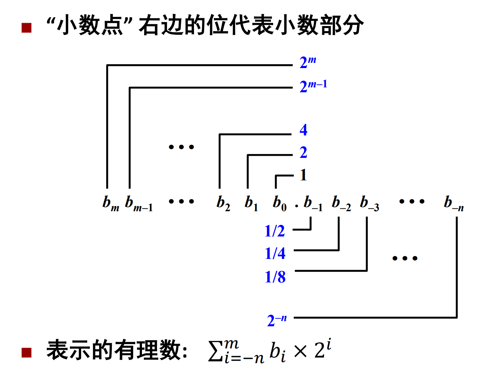
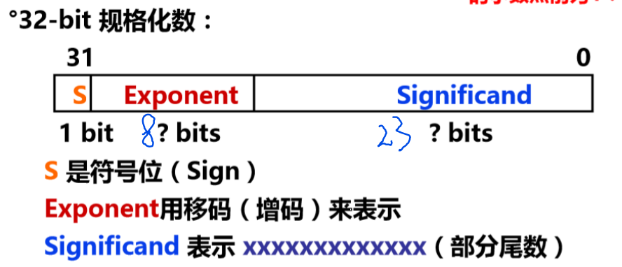

# 2.4 浮点数

这节我们将学习计算机如何表示浮点数和浮点数的运算。

## 2.4.1 二进制小数

二进制小数是对二进制整数概念的拓展。

二进制数的小数点是二进制小数点，在左边每个位代表2的非负数次冥，在右边每个位代表2的负数次冥。

eg:

10.111~2~= 1*2^1^+ 0 * 2^0^ + 1 * 2^-1^ + 1 * 2^-2^ + 1 * 2^-3^ = 2.875

二进制小数点的左移和右移会产生乘除运算

二进制小数点右移一位 -> 除以2

二进制小数点左移一位 -> 乘以2

缺点：

1. 在有限位数下表达的之不够精确。

2. 小数点隐含在w位编码的某一个固定位置上

## IEEE 浮点数标准: IEEE 754

IEEE浮点数标准用如下形式表示一个数
$$
V = (-1)^{s} * M * 2^{E}
$$

- **（Sign）s：**用来确定V的正负性，当s=0时表示正数，s=1时表示负数。用一个单独的符号位直接进行编码。

- **（Exponent）E：**对浮点数进行加权。使用k位二进制进行编码。

- **（Significand）M：** 是一个二进制小数，通常介于1和2或0到1之间的小数。使用n位二进制进行编码的小数。

  

