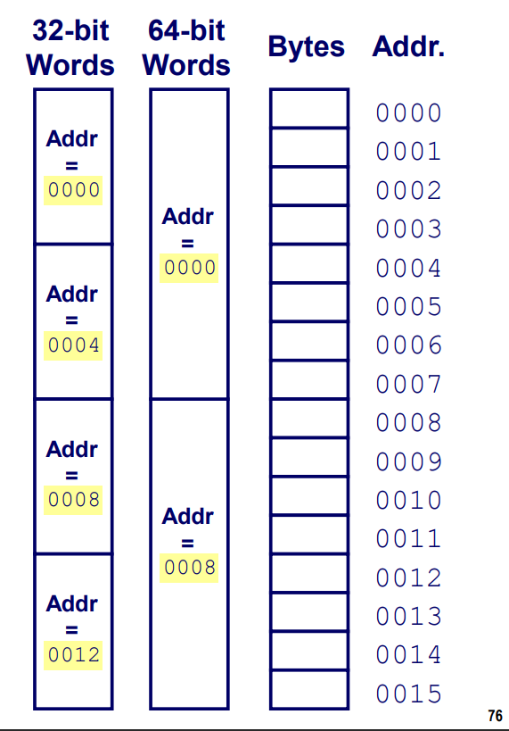

前言：这篇博文是我学习*Computer Systems: A Programmer's Perspective*这本书整理的笔记，同时参考了B站@刘迪望和@九曲阑干等up主的翻译和原创视频，力求尽我所能将这本神书的笔记写到最好。

## 2-1 信息的存储

<!-- more -->

## 1. 信息存储

通常情况下，程序将内存视为一个非常大的数组，数组的元素由一个个字节(`Byte`)表示，每个字节都有一个唯一的数字来表示，我们称之为地址（address）。这些所有地址的集合就称为虚拟地址空间（Virtual Address Space）。

### 字节（Byte）

一个字节是由8个位（bit）组成，在二进制表示法中，每一个值可能由两种状态，0或者1。当这8个位全为零时，表示一个字节的最小值。当这8个位全为1时，表示最大值(大多数情况下)。如果用十进制来表示，那么一个字节的取值范围就在0~255（包含0和255）之间。我们把这种按照一位一位表示数据的方式称为位模式。

我们引入16进制来表示位模式，对于十六进制，是由0-9和A-F来表示16个可能的值。在C语言中，十六进制是以0x开头的，这个X可大写可小写，字母部分同样部分大小写。

### 字长（word size）

任何一个机器都有一个“字长”，字长是地址的名义长度。

地址指向计算机中指定字节的位置，相邻字的地址相差4（32位机器）或 8（64位机器）。



字长决定了虚拟地址空间的上限。对于一个字长位w位的机器，虚拟地址的范围时0~2的w次放减1。近些年，高性能服务器，个人电脑以及智能手机已经完成了从32位字长到64位字长的迁移。对于32位（32字长）的机器，虚拟地址空间最大位4GB，而64位的机器，虚拟地址空间最大位2^32^*4GB（16EB）。在迁移过程中，64位的机器做了向后兼容，因此位32位机器编译的程序也可以运行在64位机器上。通过特定命令可以在64位机器上编译生成32位机器上运行的程序。

```shell
## 32bit program
linux> gcc -m32 -o hello32 hello.c
## 64bit program
linux> gcc -m64 -o hello64 hello.c
```

hello32可以在32位和64位机器上均可运行，但hello64只能运行在64位的机器上。

对于32位和64位程序，主要的区别还是在于程序是如何编译的，而不是运行机器的类型。

C语言中，支持整数和浮点数多种数据格式。

| C declaration |                | Bytes  |        |
| ------------- | -------------- | ------ | ------ |
| signed        | unsigned       | 32-bit | 64-bit |
| [signed]char  | unsigned char  | 1      | 1      |
| short         | unsigned short | 2      | 2      |
| int           | unsigned int   | 4      | 4      |
| long          | unsigned long  | 4      | 8      |
| int32_t       | uint32_t       | 4      | 4      |
| int64_t       | uint64_t       | 8      | 8      |
| char *        |                | 4      | 8      |
| float         |                | 4      | 4      |
| double        |                | 8      | 8      |

**以上表格内容需牢记**

对于我们需要存储的数据，我们需要搞清楚该数据的地址是什么，以及数据在内存中如何排布的。


通过在不同的系统上运行字节打印程序，可以打印输出程序对象的字节表示

```c
#include <stdio.h>
typedef unsigned char *byte_pointer;

void show_bytes(byte_pointer start, int len){
    int i;
    for (i = 0; i < len; i++)
        printf("%.2x", start[i]);
   	printf("\n");
}

void show_int(int x){
    // byte_pointer 强制类型转换告诉编译器，程序应该把这个指针看成指向一个字节的序列，而不是这个对象原始的数据类型。
    show_bytes((byte_pointer) &x, sizeof(x));	
}
```

**Result**

| Machine  | Value  | Type | Byte(hex)   |
| :------: | ------ | ---- | ----------- |
| Linux 32 | 12,345 | int  | 39 30 00 00 |
| Windows  | 12,345 | int  | 39 30 00 00 |
|   Sun    | 12,345 | int  | 00 00 30 39 |
| Linux 64 | 12,345 | int  | 39 30 00 00 |

| Machine  | Value    | Type  | Byte(hex)   |
| :------: | -------- | ----- | ----------- |
| Linux 32 | 12,345.0 | float | 00 e4 40 46 |
| Windows  | 12,345.0 | float | 00 e4 40 46 |
|   Sun    | 12,345.0 | float | 46 40 e4 00 |
| Linux 64 | 12,345.0 | float | 00 e4 40 46 |
虽然整型和浮点数都是对数值12345进行编码，但是他们却有着完全不同的字节模式

| Machine  | Value  | Type |        Byte(hex)        |
| :------: | ------ | ---- | :---------------------: |
| Linux 32 | & ival | int* |       e4 f9 ff bf       |
| Windows  | & ival | int* |       b4 cc 22 00       |
|   Sun    | & ival | int* |       ef ff fa 0c       |
| Linux 64 | % ival | int* | b8 11 e5 ff ff 7f 00 00 |

### 指针


## 2.1.4 字符串的表示

C中的字符串是由null结尾的一组字符。每个字符都按照某种标准的编码方式表示，最常见的编码标准是ASCII码。

如对照ASCII表，字符串“123456”由16进制 **31 32 33 34 35 00**表示。（在十六进制中用 **0x00** 表示  ``NULL``）。只要是采用了ASCII码的编码标准的计算机系统，字符串的表示方式都是一样的，在这一点上字符数据比二进制数据更加具有独立性。

在C语言中``strlen``函数计算字符串的长度时忽略最后结尾的NULL，返回`size_t` (the unsigned integer type)类型的值。

```C
#include <stdio.h>
#include <string.h>
int main()
{
    char a[20]="Program";
    char b[20]={'P','r','o','g','r','a','m','\0'};

    // using the %zu format specifier to print size_t
    printf("Length of string a = %zu \n",strlen(a));
    printf("Length of string b = %zu \n",strlen(b));

    return 0;
}
```

**Output**

```C
Length of string a = 7
Length of string b = 7
```

由于每种数据类型的编码规则都是不同的，所以二进制代码在不同的硬件或者操作系统上一般都是互不兼容的。ASCII码的广泛应用，使不同公司制作的计算机，能相互交换数据。但它有个限制：它是为英语设计的。

幸运的是，一个字节有八位，可以表示256个不同的值。ASCII码仅仅规定了前128个二进制数的字符表示，因此第128位到255位字符就被空缺出来，给各个国家自己规定标准的编码方式。这些保留下来给每个国家自己安排 准，在一个国家的电脑上打开另一个国家的语言的文档，不可避免的会出现乱码问题。

随着计算机在亚洲兴起，这种做法彻底失效了。比如汉语这样的语言有成千上万的字符，根本没有办法用8位来表示所有的字符。

所以Unicode诞生了，统一了所有编码的标准。最常见的Unicode是16位的，有超过一百万个位置，对每个语言的每个字符都够了，甚至还有多余的位置存放数学符号以及Emoji。

就像ASCII用二进制来表示字母一样，其他格式，比如MP3或者GIF，用二进制编码声音/颜色，表示照片，电影和音乐。

## 2.1.8 C语言中的逻辑运算

C语言中的逻辑运算符有`||`, `&&` 和 `!`,对应于逻辑操作中的 `OR`, `AND`, `NOT`。**注意不要将逻辑运算符与位运算符`|`, `&`, ` ^` 弄混，它们的操作是截然不同的。**

C语言的逻辑运算符一个重要的特点是，如果在前一个参数就能判断结果表达的真假，那么后面的参数将不做考虑，无论它们有效与否。

例如：

``` c
a && 5/b
```

若参数a为假，则整个表达式的真值可以确认为假，那么参数 5/b的真值将不做考虑，即使b的值为零，即5/b本身为无效表达式，都不会导致编译器报错。

## 2.1.9 C语言中的移位操作

C语言的逻辑位移分为左移和右移。其中右移操作分为两种，算术右移和逻辑右移。

算数右移以0来填充左边的由右移而来的k个空位。

逻辑右移以最高位(The most significant bit, 即二进制中权重最大的那个位)来填充由右移而来的k个空位。即若最高位为0，则以0来填充由右移而来的k个空位。同理，若最高位为1，则以1来填充右移而来的k个空位。

具体如下表格所示

|      Operation      |    Value 1     |    Value 2     |
| :-----------------: | :------------: | :------------: |
|     Argument x      |   [01100011]   |   [10010101]   |
|  x >> 4 (logical)   |   [00000110]   |   [00001001]   |
| x >> 4 (arithmetic) | [**0000**0110] | [**1111**1001] |

几乎所有的编译器和机器都**以算术右移作为有符号数右移的方式**。另一方面，对于无符号整数，**执行的右移操作一定为逻辑右移**。

1、什么样的数据类型可以直接移位

char、short、int、long、unsigned char、unsigned short、unsigned int、unsigned long都可以进行移位操作，而double、float、bool、long double则不可以进行移位操作。

**注意事项**

1. 在C中移位的数量最好不要超过数据本身的位数，如果超过了数据本身的位数，那么将会对移位数量进行取模操作，以数据本身的位数为除数取模。

   ```c
   int lval = 0xFEDCBA98 << 32;	// int 类型变量有32位。
   int aval = 0xFEDCBA98 >> 36;
   
   // output
   lval 0xFEDCBA98 // 逻辑左移0位
   aval 0xFFEDCB49 // 逻辑右移4位
   ```

2. 位移运算符的优先级小于算术运算符，如 `1<<2 + 3<<4`表达式中实际运算顺序为 `1 << (2+3) << 4`。其实不用记住这么多优先级，**当不清楚运算优先级时，加括号就对了！**

   
