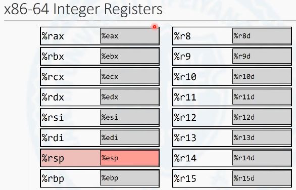
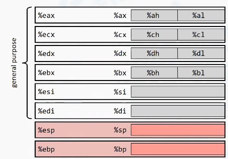

在正式介绍汇编语言之前，首先介绍一下x86处理器中寄存器的组织形式。在x86系统中，对于所有的程序员都可见的寄存器一共是有16个。这16个我们也把它叫做通用寄存器。
包括rax, rbx, rcx, rdx, rsi, rdi, rsp, rbp, 以及r8到r15一共16个寄存器。这些以r作为打头的寄存器都是64位寄存器, 也就是说，每个寄存器可以存储8个字节的数据。

<!-- more -->

汇编语言再去操作这些寄存器的时候，是以这些寄存器的名称作为操作数进行操作的。
对这些寄存器的低32位。在汇编语言中可以使用特殊的名称进行直接访问。

所有的低32位的寄存器的名称, 对于a b c d, s i, d i, s p, b p 都是以e 作为前缀进行访问的, 对于r8到r15的低32位则是增加了一个d 的后缀去访问. 那么这些寄存器是可以单独去访问它的低32位用这样的一个别名。

# x86-32位处理器寄存器形式

要想真正的去了解64位系统中的寄存器组织，就不能够不了解在x86-32位处理器中的寄存器的组织。

在x86312位系统中, 通用寄存器也就是对于所有程序员都可见的寄存器一共是有8个。它们的名称和64位系统中的寄存器相比, 去掉了r8到r15这8个寄存器, 仍然保留了a b c d, s i, d i, s p, b p 。每个寄存器的位长是32位。在32位系统中，这8个寄存器的低16位也包含着它的别名, 它的别名就是去掉了前缀e。那么就可以作为, 这32位寄存器中的低16位，而使用汇编语言单独进行访问, 尤其特殊的是对于a b c d 4个寄存器来讲, 它们的低8位和高8位也是有别名的。通过这些别名, 也可以实现对特定寄存器中的位进行访问。

x86-64位指令集是可以对x86-32位指令集进行兼容的。
因此, 对于x86-64位系统的处理器中的寄存器进行访问也可以通过上述32位系统中，这些寄存器的别名去访问到寄存器的第16位。对于a b c d 4个寄存器, 它的低八位,和从第八位到第15位，也是可以采用这样的别名来去访问。

**在x86-64位系统和x86-32位系统中, 所有的s p 寄存器, 都有一个特殊的用途, 用来存放帧顶指针。**

