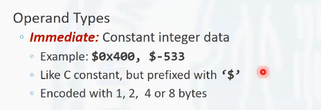
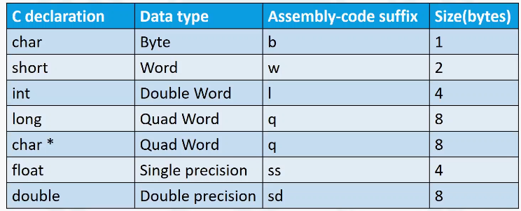

# 3.4.1 数据访问指令

数据访问指令, 它的助记符是move。通过这个名称，可以看出来，它实际上进行的是在源操作数以及目标操作数之间移动数据。虽然它的助记符是move, 但是更确切的去描述的话，可以理解为, 它是将源操作数中的数据复制到目标的位置，也就是源操作数中的数据是不会发生改变的。

<!-- more -->

## 操作数的形式

对于操作数, 有三种形式。

第一种形式叫做立即数。立即数通常是一个常数的整数类型, 比如0x400, 是一个十六进制数, 或者是-533。对于-533, 进行一个数据移动实际存到目标位置的数据是-533所对应的补码值, 对应的补码值的位长是由操作数中所携带的数据格式信息所确定的。在这个例子中, 操作码是moveq , q 所表示的信息是八字节，也就是64位。所以如果用moveq 去对这个立即数输出操作, 目标操作数所在的位置应该是-533的一个64bit的补码形式, 最后存储到目标操作数的位置.

立即数与c 语言的常数是类似的，但是在立即数中, 它需要增加一个前缀$(dollar) 符号去描述，这是一个常数。对于立即数操作，可以有1字节、2字节、4字节, 8字节四种操作方式, 这主要取决于操作码的最后一位。也就是, 操作码的最后一个字母, 用来去描述这一次操作的数据位长。

第二种类型叫做寄存器类型。寄存器也可以作为move指令的操作数存在。16个通用寄存器中的任意一个都可以作为操作数。除了64位的16个通用寄存器之外，在这些寄存器中的低32位或者低16位、低八位或者是第八位到第15位，也可以通过move指令去操作, move指令操作的数据位长是由它所决定。

在64位的指令中, r a x, r13前面都有百分号, 这些都是一个合法的操作书. 所有的通用寄存器都可以采用这种方式去做操作。但要注意的是r s p 寄存器, 一般在编写汇编语言程序的时候, 不能把它当做一个普通的寄存器去使用。因为r s p 寄存器有特殊的用途，r s p 寄存器在汇编语言中用于存放程序运行时栈的栈顶数据的地址的。其它的寄存器在某些应用场景下也有一些特殊的用途。

move指令的第三类操作数是内存。move指令可以通过访问内存的某个地址的方式，从内存中加载数据，或者是把数据存放到内存中。

最简单的一个例子。`(%rax)`, 它用来描述的是rax 中存放的数据，实际上是一个地址。那么加上括号也就是去访问对应rax 所在地址的数据。这点非常像c 语言中的指针类型指针表示一个地址, 通过在指针前面增加星号，意味着是对这个地址中的数据进行访问. 在汇编语言中是使用括号中间加寄存器的方式也可以进行访问。

## move指令操作数的组合

move指令以及三类的操作数，它们之间有一些固定的组合关系。具体如图所示

注意事项:

**1. 立即数只能作为源操作数出现，不能作为目标操作数出现.** 因为我们无法给一个常量进行赋值。

2  **如果源操作数为内存的某个地址的话, 目标操作数必须为寄存器。**move指令是不支持直接将一片内存地址所指向的数据赋值给另一个内存地址. 因为在冯诺依曼体系结构中，处理器是整个计算机的核心, 所有的指令都要通过处理器来去完成, 也就意味着在这个过程中是需要有处理器参与的。如果将一片内存中的数据赋值给到另一片内存中，意味着绕过了处理器。所以在x86的指令中，不提供这样的指令。

如果想在两片内存之间搬运数据，需要以寄存器作为中间媒介进行过渡, 也就是先从内存中, 把数据加载到寄存器里, 然后再通过寄存器把数据放到另外一片内存中。

# 3.4.2数据访问指令实例

左边是c 语言的源码。它实现了一个两个内存区域之间的数据交换, 也就是传入的x p 指针所指向的long形数据和yp指针所指向的long形数据进行了一个交换。在c 语言中定义了两个临时变量，用来暂时存储xp 数据的值和yp 数据的值. 然后分别把这个值交换位置存储回x p 和y p 。这也就实现了两个指针所指向地址数据的交换。

# 3.4.3 寻址模式

## 完全寻址模式

在x86汇编指令中, 对于内存寻址的方式是非常灵活的. 一个完全内存寻址方式可以采用这样的一个4元组来去表示。
                                                       **D(Rb, Ri, S)**

D是一个偏移量, 它是一个基于内存地址的偏移量，可能是1字节两字节、4字节或者8字节的一个常数。D是一个有符号数. R~b~ 表示内存的基地址, 它是任意的一个整数都可以去描述。R~i~ 叫做索引寄存器, R~i~寄存器。除了rsp寄存器不能作为R~i~去表示, 其它的寄存器都可以在R~i~的位置所表示。

S是表示大小, 它只能是1, 2, 4, 8这几个常数中的一个。因为在高级语言处理数据类型的时候, 基本数据类型的位长, 只有这样的四个值。

该4元组遵循下列规则完成完全寻址模式. 

​                                        **Mem[Reg[R~b~] + S * Reg[R~i~] + D]**

 把R~b~寄存器中的一个值, 加上R~i~寄存器中的值乘以S, 再加上D 。利用这样一个运算算出来的值，作为实际内存的访问地址, 从内存的这个地址中去访问数据。这是一个非常灵活的寻址方式. 在这里可控的有两个可变的东西，一个是R~b~寄存器，一个是R~i~寄存器。

### 完全寻址模式特例

完全寻址模式有一些特例

进一步的去理解这样的一个完全寻址模式。它和对于数组中的某个下标所在元素进行地址计算的时候的选址非常类似。可以理解为R~b~是数组的首元素地址, 可以把R~i~理解为数组的下标。那么想访问R~i~这个下标的元素，这个元素的地址在哪？就是数组的首地址，加上数组的下标乘以数组中每一个元素的数据位长就可以得到。因为完全寻址模式通过这样的一个灵活的寻址，可以在处理器中很好的去支持数组的访问。通过增加了一个偏移量D, 它可以对于结构体的支持可以实现的更好。

### 实例

需要注意的是, 使用move指令去做访问的时候, 采用这样的内存寻址方式, 不是将这样的一个数值赋值给目标操作数, 而是将这个地址所指向的内存中的数据复制给目标操作数。

# 3.4.4 操作码的后缀

数据传输指令，它的助记符是move。在实际应用中，move等指令后面通常包含一个后缀。

对于单字节, 它的后缀表示为d . 双字节, 又叫做字,是word 的首字母, 所以被称为w. double word 叫做双字，实际上是四字节, 对应的操作后缀是l Quadword 表示叫4字，也就是8个字节, 它的后缀是q 。注意一个地址，它的类型也是Quadword, 因为一个地址也是64位的，所以对地址做操作的时候，也是要用q 后缀. 单精度浮点数，它的后缀是ss,  双精度浮点数，它的后缀是sd 。

在`AT&T` 汇编语言中, 所有的指令助记符后面都会跟有这样的一个后缀用来去描述当前指令所操作的数据的位长.

后缀决定了源操作数和目标操作数的位长. 比如说我们用的是moveb, ，注意后面的两个操作数, 也必须是一字节的两个寄存器。

如果使用move指令, 进行内存访问的时候, 根据后缀决定了我们从内存对应的地址到底访问几个字节的数据, 也就是从那move操作内存的时候，不是只访问那个地址的一个字节的数据。那个地址只是起始地址. 访问几个字节, 是由这个后缀来去决定的。
