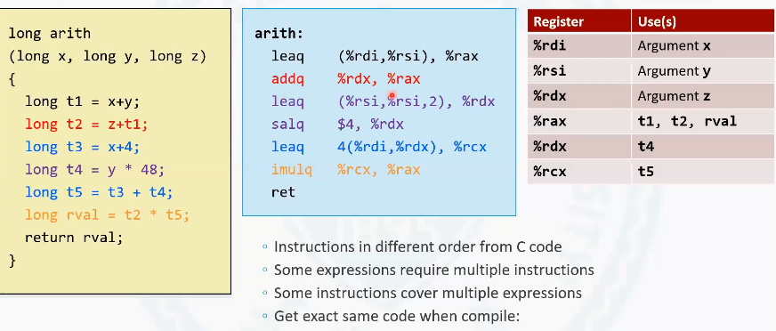
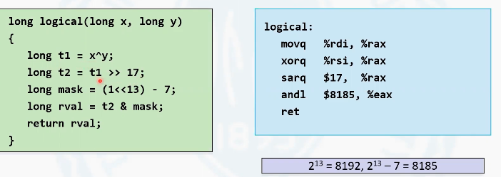

# 3.5.1 加载有效地址

地址运算指令写法是lea 作为它的助记符，也就是操作码。由于在x86-64位系统中，地址都是64位。所以一般见到的这条地址运算指令，它的这个尾部的数据格式都是以q 作为后缀。

<!-- more -->

lea指令是一个双操作数指令，有源操作数和目标操作数。源操作数通常是一个类似于寻址模式的一个4元组, 该4元组用来进行地址表达式的计算。目标操作数通常是一个寄存器, 用来存放算术运算的地址的结果，存放到寄存器里。

## 基本用法

地址运算指令，它在设计的初衷的时候，主要是用来去计算像c语言中如`p = &x[i]`的表达式所对应的一个地址。比如说计算变量x 数组的第 i 的下标所在索引的地址, 赋值给p指针，P存放的是一个地址。计算方法是先算出x 的基地址, 再算出x 中每个元素它的位长, 然后再乘以这个下标i , 得到的就是最后的位置。每个元素的大小, 在高级语言中，通常我们能够见到的就是这四种类型, 就是一字节两字节、四字节或者是八字节。所以在计算的时候, 就是乘以每个数组元素的位长，通常就是这四个数值。

**实例** 

在这个具体的这条指令中, D缺省，缺省的时候为D = 0, R~b~为rdi 寄存器中的值, r~i~也为rdi 寄存器中的值, S = 2。
这样再做一个运算, 是r d i加上r d i 乘以2。和move指令最大的区别是, move指令是把计算后的地址所在的值取出来，放到目标寄存器中。而l e a 指令是把地址算出来, 直接把这个地址赋值给目标的操作数，也就是rax寄存器。换句话说，l e a 指令是不会对内存进行任何访问的。r d i 寄存器是用来存放传入的这个参数x 的。所以这条指令的含义就是x 加上x 乘以2, 然后赋值给r a x 寄存器。所以这个时候r a x 应该是3x。

接下来执行了一个左移指令, 后面会讲到.

那么最后得到的就是x 乘以12作为这个函数的返回值. 

在这个实例中, 可以看到本身是一个乘法，一个变量乘以一个常数, 通过编译器转换成汇编语言之后，把它转换成, 1个地址计算指令和1个移位运算指令。因为乘法对于处理器来说，它在计算的时候是一个非常耗时的一个操作, 但是对于基本的运算如加减，基本的移位运算, 它们的运算速度要远远的快于乘法运算的速度. 所以编译器不使用乘法指令去做这样一个x 与常数的相乘, 而是把它转换成很多加法和移位指令的组合。虽然一个乘法指令转换成了两条指令, 但是这两条指令执行的速度, 仍然比一条乘法执行的速度要快的多。所以编译器通常会做这样的一个转换。

l e a 指令虽然最初在设计的时候, 是做地址计算使用, 但是在编译器实际使用的过程中，因为l e a 指令的特性不做任何内存的访问, l e a 指令通常也被用来去进行一些算术运算, 这也是编译器在编译的时候的一个技巧。而l e a 进行的这个算术运算，可以去模拟一些变量与常数之间的运算, 这也是编译器经常使用的一种技巧。

# 3.5.2 双操作数指令

## 注意事项

1. **源操作数和目标操作数相加的结果放到目标操作数里. **由于第二个操作数是目标操作数，所以所有的这些二元操作数的这种指令，最后运算的结果都是放到第二个操作数. 尤其减法这种两个操作数之间是有顺序的运算, 是目标操作数，也就是目标操作数是被减数, 源操作数是减数。减完的结果存到原先被减数所在的位置中去。
2. **注意区分算数移位和逻辑移位.**  移位指令中间有a, 代表算数移位; 中间有h, 代表逻辑移位.
3. **源操作数可以是立即数, 寄存器和地址, 目标操作数只能是地址和寄存器.**
4. 在加减乘运算中, 并没有区分有符号运算和无符号运算. 因为加法运算和减法运算本质上是相同的, 加法减法运算和乘法运算对于有符号数和无符号数来讲，在位级别的运算规则也是相似的。
5. 除法运算分为有符号数除法和无符号除法.

# 3.5.3单操作数指令

 看图即可

# 3.5.4 算数运算示例

左面是进行了一些复杂表达式的运算，最后把运算的结果rval变量作为返回值返回。
传入的参数有3个参数，x, y, z ,通过编译器可以将这段高级语言的语句翻译成汇编语言的指令. 

用颜色对高级语言中的表达式进行了一个划分, 通过颜色来去确认对应颜色的高级语言的语句。

第一条指令是将x 和y 的值相加，存在变量t1中。x 存放在r d i 寄存器中。
也就是函数的第一个参数是存放在rdi寄存器中的, 函数的第二个参数是存放在rsi寄存器中,函数的第三个参数是存放在rdx寄存器中。函数的参数的顺序和寄存器之间是由某种固定关系的。在x86的linux操作系统下啊，第一个参数，第二个参数和第三个参数会固定的映射到这三个寄存器中。

第一个指令是x 和y 相加, 把结果存在t1 变量中，它所对应的汇编指令是使用了一个地址计算指令rdi和r s i 相加, 存放到了rax 里。

为什么在这儿要用地址计算指令, 而不使用标准的算术运算指令add呢? 用add的效果似乎和这个效果是一样的。一个最主要的原因是add指令, 是两操作数的指令, 也就是在运算之后，必然结果会覆盖掉其中一个操作数的值。表达式中后边的运算, 原来的参数x 的值也要参与其他的运算, 原来参数y 的值也要参与其他的运算。所以如果把第一个x +y 这个指令语句转换成add 指令的话，那么必然x 和y 的值有一个值要被破坏。如果不希望它被破坏，那么我们就需要再用一条move指令把某个被破坏的值提前备份出来。这样就变成了move和add两条指令才能完成第一条语句的工作。而地址预算指令可以在多个寄存器之间完成运算, r d i 的值和r s i 的值相加之后，是会存放到r a x 寄存器中, 这样相当于在这个运算的过程中，既做了加法, 同时把加法的结果又放到了一个新的 寄存器中，不破坏原寄存器的值。使用这样一条指令，相当于使用了一条move指令和另一条add指令。这个是编译器的一个设计巧妙的地方。

第二条语句是把z 和t1 相加存放到第t2中，z的值存放在rdx寄存器中, rax 里边存放的是t1 的值, 相加完了之后存放到rax 寄存器中。那么这个时候rax 寄存器中存放的就已经是t2的值了。t1的变量就已经不存在了。就这点是否合理而言, 可以从左边的语句来分析一下。t1变量最后一次使用就是在第二句, 也就是说后面不使用t1 这个变量。因此在第二句将t1变量覆盖掉是合理的。这体现了编译器的另外一个功能, 就是在寄存器的使用之间进行调度, 合理的去使用寄存器。

紫色的这两条语句对应的是y 乘以48赋值给t4变量。编译器并没有继续执行t 3的这条语句，而是执行了t 4。y 乘以48和我们之前讲到的地址运算的那个例子相似。它是通过两条指令, 从而替换掉了乘法运算指令, 使得计算加速。

首先做的是r s i 加上r s i 乘以2。这个过程就是实现了y乘以3。y 乘以3的结果存放到rdx寄存器中。r d x 计算器之前存放的是z 的值, 但是在t 2这条指令之后，再也不会使用到z 这个变量, 所以r d x 寄存器器可以回收被重新利用。下面一行指令做的是将r d x 寄存器左移4位，相当于乘以二的四次方, 等于乘以16。y乘以3，再乘以16就等于y 乘以48。因此，这条指令通过这样一个两条汇编指令就可以实现。

下一条指令在做的实际上是这第三句t3的语句和第五句t5的指令. x加4, 结果作为t3，然后和t4相加。也就是说，在高级语言中的两条语句, 可能对应到汇编语言中只有一条指令。具体的做法是r d i存放的是, x 的值, r d x 存放的是刚才运算的结果，也就是t 4的值。
S缺省就等于1，所以就是x 加上t 4。外面还有D=4，所以是x+t4+4, 等于t 3和t5这两条语句在汇编语言中做了一个合并。因为t3是中间变量可以回收, 所以在这里编译器会把这两条指令, 合并合并成一条地址计算指令就可以得到结果。r c x 计寄存器最终存放的是t 5的结果。

最后t 2要和t 5做一个乘法, 因为t 2是变量，t 5也是一个变量, 所以这样两个变量相乘，是没有办法把它当成是一个变量，当成一个常数，它进行一个分解。所以在这里不得不使用一个惩罚指令来完成。因为惩罚指令是极其耗时的。而在这里没有办法用其他的方法去降低这时间上的开销。

r c x 存放的是t 5的值，r x 存放的是t 2的值, 两个相乘的结果放到r a x 寄存器中。
这里在c 语言中, 返回值是r va l . 而在汇编值令中呢，调用的过程返回的时候, 就是使用rax寄存器来去保存返回值。这个是在汇编语言中的一个固定的用法，也就是**r a x 计算器作为返回值的存储。**

## 特征

第一个特征就是**c 语言中的语句顺序和编译后生成的汇编指令的顺序不一定是完全一样的**。也就是指令在执行过程中顺序并不是c 语言中的逻辑顺序, 但最终运行结果是相同的, 编译器在这个过程中可能会打乱顺序。

第二点**c 语言和汇编指令之间并不是一个一对一的关系。**
某些c 语言的表达式的计算可能映射到汇编语言会被映射成多条指令才能完成, 比如说t 4这个例子会被映射成两条汇编指令。在c 语言中，也有可能多条语句都会映射到某一个指令上, 比如说计算t 3和t5, 虽然在c 语言中是两条语句, 但实际上它对应的是一条汇编指令。

最后一点, **寄存器中进行运算，要比在内存中读取数据进行运算性能要快得多, 编译器会优先把所有的局部变量放在寄存器中。** 如果我们将这样的一个c 语言的语句直接写成return(x+y+z)×((x+4+y×48)), 最终得到的最终的汇编语言指令是相同的。虽然在计算中使用了很多临时变量, 但是这些局部变量不一定需要在内存中存储。在这个例子中，用了6个临时变量。但是这6个临时变量都是存放在寄存器中。换句话说, 这六个变量不消耗内存。这也就是说不要建立一个固定的认识认为声明了变量就会浪费系统内存, 这个概念是错误的。因为我们的编译器已经足够的聪明，足够的智能, 它可以通过合理的去分配寄存器，让这些局部变量优先存储到寄存器中。

另外一点, **不要以为写了这样一个表达式直接去替代这样一个函数的结果，就可以实现对程序的优化。这种认识是完全错误的，虽然语句少了, 但是代码最后执行的效率是一样的。**千万不要以为在编程的时候，少用一个局部变量，或者把表达式写的极其复杂，就变成了对程序做了某种优化。实际上这种认识是完全错误的。从这个例子中可以看到，其实我更推荐于我们例子上的这种写法。为什么？因为在例子中，语句多的写法更便于阅读, 更便于其他的人再去阅读你的代码的时候，更容易的去了解这个表达式的具体含义。
如果表达式计算的每个步骤，它都是有相应的物理意义或者是现实意义的话，我们可以用一些特殊的变量命名表示出这种目的意义，这样就会很清晰的看懂这个表达式。但是如果你把表达式压缩到表达式非常少, 这可能对于代码的阅读来讲是会很困难。

换句话说, 语句多的写法和语句少的写法，最后的效果和效率都是一样的。那么哪一种更好呢？当然是对于用户可读性更强的这个代码, 效果会更好。

# 3.5.5 逻辑运算示例

看一个以位的逻辑运算为主的一个例子。

这里面主要使用到了异或(^), 右移(>>), 这个右移主要是算术右移, 因为t1和这个常量17都是有符号数。在C语言语句中还用到了左移和减法, 但是在生成的汇编语言表达式中并没有左移和减法运算。之后还用到了位与运算。rdi 存放的是参数x , rsi 存放的是参数y 

第一步是把rdi 复制到rax 中。第二步, rsi和rax 进行一个异或，异或的结果存放在rax。此时rax寄存器中存放的是 `x^y`, 即t1的值. 第三步把rax 存储的变量进行算数右移17位 , a 表示算数二表示右移, 对应于C语言的第二个语句. 得到的结果为t2, 因为t1在后面的语句中不会再使用, 第二个语句运行的结果可以存放在rax寄存器中.

第三步, c语言语句的第三步计算mask在汇编代码中没有体现, 因为mask 的结果本身是一堆常量来去进行的计算, 在这个表达式中不涉及任何的变量, 这也就意味着不管在什么情况下，mask 应该都是一个固定的值。在这条语句执行之后。因此这样的一个左移和减法的计算过程，实际上是由编译器在编译阶段就已经完成计算。计算完mask的十进制为 8185. 第四步, 对t2和mask进行一个位运算得到rval. 

**常量与常量之间的运算是在编译器完成的，而不是在运行的时候进行的计算。**这样运行的时候少掉了很多指令, 就增加了运行时的速度。

最后还有一点, 需要注意的是编译器编译出来发现and助记符后缀为l, l表示这是一个32位的指令。运算双方t2和mask都是64位的变量, 但是这里却是用了一个32位的指令.

> 背景知识;
>
> 在x86-64位处理器上，如果执行一个32位的指令，意味着最后操作的目标寄存器的高32位会被清0。
> 		深层次的说，这是64位处理器，在设计数据通路的时候, 就是用的这种方法去兼容的32位的指令。

这里的原因如下,  mask 虽然是一个long型(在64位系统中为8字节)的变量, 但是它的高32位的运算结果必然为0。因为整数常量在不做任何说明或增加后缀的时候, 都是以int 型的有符号数常量存在的。所以一个常量运算的结果本身是一个int型 的常量。如果把它赋值给了一个long型的变量。那么在这个过程中会发生一个位扩展。位扩展的时候，由于它是一个正数，所以它高32位在扩展的时候必然为0。高32位为零的mask变量与t2进行位与运算, 结果必定高32位全为0. 也就是说rval的值体现在低32位上.

在and执行32位指令后, 将最终的结果存储到了eax寄存器. 而eax寄存器就是rax寄存器在低32位上的一个别名, 最终返回的还是rax寄存器中的值.