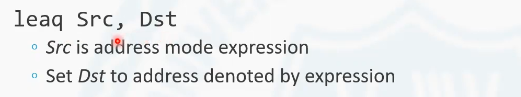
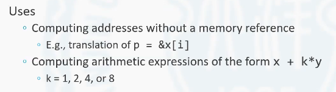
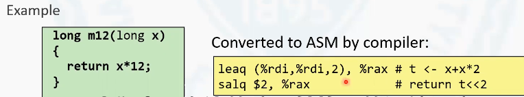
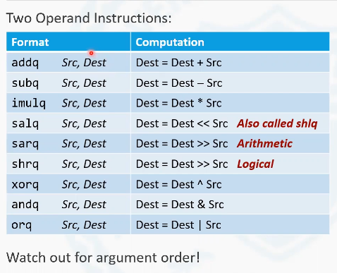
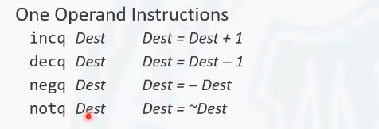

# 3.5.1 加载有效地址

地址运算指令写法是lea 作为它的注记符，也就是操作码。由于在x86-64位系统中，地址都是64位。所以一般见到的这条地址运算指令，它的这个尾部的数据格式都是以q 作为后缀。

lea指令是一个双操作数指令，有源操作数和目标操作数。源操作数通常是一个类似于寻址模式的一个4元组, 该4元组用来进行地址表达式的计算。目标操作数通常是一个寄存器, 用来存放算术运算的这个地址的结果，存放到寄存器里。

## 基本用法

地址运算指令，它在设计的初衷的时候，主要是用来去计算像c语言中如`p = &x[i]`的表达式所对应的一个地址。比如说计算变量x 数组的第 i 的下标所在索引的地址, 赋值给p指针，P存放的是一个地址。计算方法是先算出x 的基地址, 再算出x 中每个元素它的位长, 然后再乘以这个下标i , 得到的就是最后的位置。每个元素的大小, 在高级语言中，通常我们能够见到的就是这四种类型, 就是一字节两字节、四字节或者是八字节。所以在计算的时候, 就是乘以的那个每个数组元素的位长，通常常见的就是这四个数值。

**实例** 

在这个具体的这条指令中, D缺省，缺省的时候为D = 0, R~b~为rdi 寄存器中的值, r~i~也为rdi 寄存器中的值, S = 2。
这样再做一个运算, 是r d i加上r d i 乘以2。和move指令最大的区别是, move指令是把计算后的地址所在的值取出来，放到目标计算器中。而l e a 指令是把地址算出来, 直接把这个地址复制给目标的这个操作数，也就是rax寄存器。换句话说，l e a 指令是不会对内存进行任何访问的。r d i 寄存器是用来存放传入的这个参数x 的。所以这条指令的含义就是x 加上x 乘以2, 然后赋值给r a x 计算器里。所以这个时候r a x 应该是3x。

接下来执行了一个左移指令, 后面会讲到.

那么最后得到的就是x 乘以12作为这个函数的返回值. 

在这个实例中, 可以看到本身是一个乘法，一个变量乘以一个常数, 通过编译器转换成汇编语言之后，把它转换成, 1个地址计算指令和1个移位运算指令。因为乘法对于处理器来说，它在计算的时候是一个非常耗时的一个操作, 但是对于基本的啊加减运算，基本的移位运算, 它们的运算速度要远远的快于乘法运算的速度. 所以编译器不使用乘法指令去做这样一个x 与常数的相乘, 而是把它转换成很多加法和移位指令的组合。虽然一个乘法指令转换成了两条指令, 但是这两条指令执行的速度, 仍然比一条乘法执行的速度要快的多。所以编译器通常会做这样的一个转换。

l e a 指令虽然最初在设计的时候, 是做地址计算使用, 但是在编译器实际使用的过程中，因为l e a 指令的特性不做任何内存的访问, l e a 指令通常也被用来去进行一些算术运算, 这也是编译器在编译的时候的一个技巧。而l e a 进行的这个算术运算，可以去模拟一些变量与常数之间的运算, 这也是编译器经常使用的一种技巧。

# 3.5.2 双操作数指令

## 注意事项

1. **源操作数和目标操作数相加的结果放到目标操作数里. **由于第二个操作数是目标操作数，所以所有的这些二元操作数的这种指令，最后运算的结果都是放到第二个操作数. 尤其减法这种他两个操作数之间是有顺序的, 是目标操作数，也就是目标操作数是被减数, 源操作数是减数。减完的结果存到原先被减数所在的位置中去。
2. **注意区分算数移位和逻辑移位.**  移位指令中间有a, 代表算数移位; 中间有h, 代表逻辑移位.
3. **源操作数可以是立即数, 寄存器和地址, 目标操作数只能是地址和寄存器.**
4. 在加减乘运算中, 并没有区分有符号运算和无符号运算. 因为加法运算和减法运算本质上是相同的, 加法减法运算和乘法运算对于有符号数和无符号数来讲，在位级别的运算规则也是相似的。
5. 除法运算分为有符号数除法和无符号除法.

# 3.5.3单操作数指令

 

