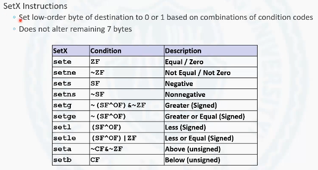
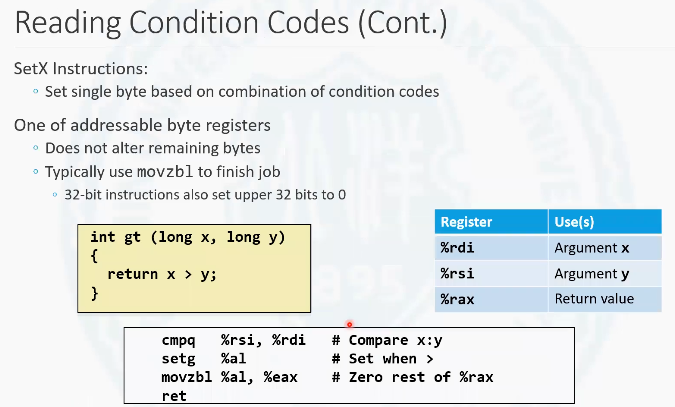
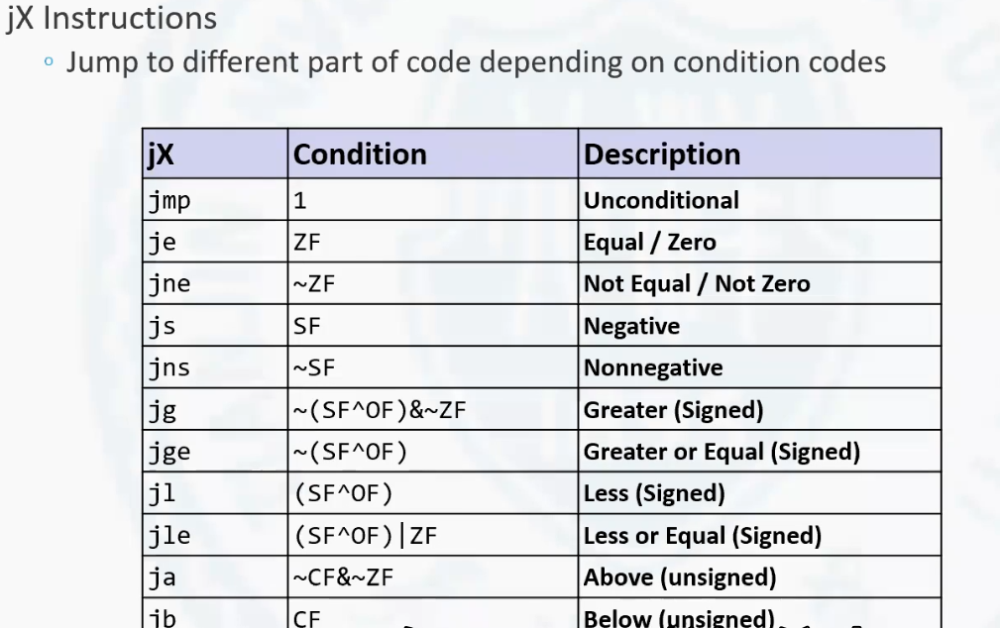

# 3.6.1 条件码

条件码是处理器中的一些特殊标志位.

首先从程序员的角度上去看一下处理器。假设一个程序正在处理器上运行, 那么这个程序当前的状态,可以通过处理器中的一系列信息可以表示出来。那么这些处理器就是所有对于程序员可见的处理器, 以及一些标志位组成的。

之前所谈到的 16个通用寄存器。在寄存器中大量的寄存器被用于表示当前程序中所使用到的一些局部变量, 

除此之外，还有两个特殊的寄存器，一个是`rsp` 寄存器，它表示当前这个程序运行时的栈的顶部地址。还有一个寄存器，就是程序计数器。在x86-64位系统中叫做`rip` 寄存器。这个寄存器中存放的是当前所执行的这条指令的下一条指令, 也就是接下来要执行的那条指令的地址。

<!-- more -->

除了这些信息之外,还有一些标志位,也用来表示当前处理器的状态,那么这些状态也是非常重要的,如果要让处理器正常的工作，正常的执行程序，这些标志位是必不可少的。这些标志位存放在处理器的一个叫做标志寄存器的专用寄存器中, 标志寄存器是不能通过汇编语言指令直接访问,但是可以间接的修改标志寄存器和间接的访问标志寄存器。

标志寄存器中,包含着一些bit,其中每个bit都有它各自的含义。在这里面我们主要讨论最重要的四个标志位。这四个标志位也把它叫做条件码, 分别是CF, ZF, SF和OF.

`CF` 是表示进位标志位。它是对于无符号数而言的, 也就是对于无符号数的两个数进行运算, 如果产生了进位，或者是借位, 这个时候, `CF`这个标志位会被置1。无符号数出现进位或者借位，就意味着无符号运算出现了溢出。

`SF`是符号标志位, 针对于有符号数, 是表示当前指令运算的结果的符号，它的符号也就是这位和当前指令运算后得到的结果的符号位是一致的。如果运算后的结果为非负数, 那么`SF`标志位为0, 如果为负数, `SF`标志位为1。

第三个标志位叫做`ZF` , 它是零标志位。当运算的结果为零的时候，`ZF`的标志位会被置1。

最后一个标志位`OF`。溢出标志位, 溢出标志位是针对于有符号数运算而言的。有符号数运算, 它有可能出现溢出，而不是进位。溢出有一些条件可以判断它。如果对于两个数，如果把它们看作是有符号数，它们在运算的时候产生了溢出。那么溢出标志位则会被置位。标志位被置位有两种方法可以进行，一种叫做隐式置位。另外一种叫做显示置位。隐式置位是通过运行一些算术运算指令之后, 可能会对这些标志位进行置位。

## 隐式置位(`Implicitly set`)

比如说有一条指令`addq` 。源操作数和目标操作数进行运算。这实际上就是做了一个两个操作数之间相加，并且把它的和复制给目标操作数这样一个过程。那么每当执行一个算术运算或者逻辑运算指令的时候, 都有可能导致这些标志位的变化, 也就是指令运算后的结果，会影响标志寄存器。

那这里可能会有一个最大的问题, `ZF`标志位比较容易理解。剩下这些标志位与有符号数和无符号数有关, 但是在处理器去执行汇编指令的时候, 它操作的是寄存器，操作的是内存。寄存器和内存中到底存放的是有符号数还是无符号数呢？实际从汇编语言的角度上是不清楚的。那么这些标志位怎么去置位呢？标志位在置位的时候，实际上是把结果既看做了有符号数，也看做了无符号数。也就是, 假设两个寄存器中的值相加, 如果是无符号数，它会不会有进位？如果有进位`CF` 就会被置位。如果把这两个寄存器中存放的数字看作是有符号数。那么它会不会溢出？如果会溢出, 它的溢出标志位就会置位。那么还要看最高位，如果是无符号数无所谓。如果要是把这个数看作是一个有符号数，如果它前面有符号位, 那还要根据符号位的值去置`SF` 。也就是说最后运算出的结果，既把它当做无符号数，也把它当做有符号数。 无符号数如果要是相关的标志位满足条件的话，会置位. 有符号数，满足相关条件的话，对应的标志位也就是条件码会被置位。

溢出标志位，它在什么情况下会被置位?就是当a 和 b 都大于零的时候, 运算的结果小于0。这个时候是必然会被置位的。另外还有一种情况就是a 和b 都小于0, 运算的结果大于0, 这个时候溢出标志位也会置位。也就是溢出的条件就是, 两个加数, 它的符号位。和和的符号位不同, 这个时候就会被置位。

当然除了加法运算之外, 减法运算、乘法运算以及其它的一些位运算每经历一条指令, 这条指令的效果都会导致这些标志位被置位或者是被复位，也就是被置为1或者置为0。

那么在算术运算和逻辑运算指令中，**有一条指令是不会影响条件码的, 这条指令就是地址计算指令。**(` NO set by leaq instruction`)也就是地址计算这几个指令执行之后，条件码是不会有任何变化的。不管它是否进位是否溢出，是否为0等等。

## 显式置位(`Explicit set`)

显式置位就是用汇编语言中一些专门的指令去修改条件码的值. 这些指令本身运算完是不会去修改操作数的。但是这些指令运算之后会影响条件码的值。

### cmp指令

比如cmp 这条指令, 它是对两个操作数进行比较。其实这个比较的过程和减法的过程非常像，也就是cmpq 这条指令和subq 这条指令非常像。它是把目标操作数减去源操作数得到一个差, 这个差的结果就会影响对应的条件码, 也就是说影响对应的标志位。但是算完的这个差不会去修改参与运算的这两个操作数。所以说它和减法运算的结果最大的不同之处是在于减法运算之后会把差放到目标操作数里。但是在 cmp 这个指令中会做减法，但是不会存放结果, 所以这条指令呢，可以认为它就是做一个比较的指令，怎么做呢？src1减去src 2。那减完了之后，可以根据符号标志位也就是`SF`和零标志位`ZF`去判断src1 和src 2 里存放的这两个数之间的关系。如果减完为负数，说明小于。如果减完了符号位为0，这个时候还需要查看0标志位。如果零标志位为1，那说明是等于。如果零标志位不为1为0，那说明是大于。那就通过这样的一个方法就可以实现这两个操作数据之间的比较。当然在这个运算的过程中也会影响进位标志位和溢出标志位。但是在通常使用的时候，使用c m p 指令之后主要观测的就是`ZF`和`SF`这两个标准。

### testq指令

另一个可以用于显示对这些条件码进行置位的指令是testq 。testq这条指令非常像andq ，andq处理指令是按位与运算, 但是andq 会把与的结果放到对应的目标操作数中。testq它不会去存放结果, 但是它运算的结果会影响标志寄存器。

testq可能会影响到的标准寄存器只有`ZF` 和`SF` 。因为位与运算是不会影响进位和溢出的。通常用testq 检查某个操作数中的某一位是否为0, 相当于一个操作数里存放的是一个数据, 另一个操作数里存放的是一个掩码。比如说检测src1源数据中最低位是否1, 那这个掩码就可以写成1, 那么它们两个与运算就是看如果最低位为1的话，那么与出来结果就是1就是非零的; 如果最低位为0，他们两个与完必然为零, 这样就可以检测最低位的情况。所以testq主要是用来进行一个掩码的检测, 当然这种方式呢还可以做更多位的同时检测. 

# 条件码的访问

条件码是不能够直接被修改.  就像使用move指令直接给某个寄存器赋值, 对于条件码是无法实现的。条件码的修改只能通过算术运算或者逻辑运算指令, 间接的显示或者是隐式的完成条件码的修改。同样, 访问条件码也没有像move这样的指令可以直接访问, 它也是需要间接的来去完成访问。这些指令就是一组指令, 就是set 这一组的指令是可以去访问条件码的。

## SetX Instructions

set这一组的指令是一个8位的指令。这个指令的格式是set作为操作码后面接着一个寄存器，这个寄存器应该是一个8位的寄存器。set这一组的指令如图所示

可以在这组指令中看到，不是每条指令都能够读对应的标志寄存器或者叫做条件码的值，而是条件码通过某种运算之后得到的值，可以用set 指令可以得到。

比如说第一条指令sete。它是用来访问零标志位, 如果零标志为1，它通过这个sete 的指令可以实现将对应的这个8位寄存器的最低位置1, 高7位置0这样的一个效果, 后面的这些set 指令也是一样, 都是用来将这8位寄存器的最低位置0或者置1. 置0还是置1，是基于条件也就是一个个位运算的逻辑表达式。
		有一个简单的方法用来记忆这些指令, 是根据英文名称的缩写. sete 是什么？sete 是前面用c m p 指令去比较的这两个操作数。如果是相等的话，sete 这条指令就会将对应的这个低八位这个寄存器的最低位置1, 也就是e 表示的是equal, 两个操作数相等就会置1。setne 呢就是当`CF` 为零的时候置1, 也就是not equal 的时候, sets 是设置符号位也就是说，如果对应这个符号为负, 那么sets 会将这这个寄存器置1。setns 就是不为负的时候置1。

下面的这几个指令setg, setge, setl, setle, 这4个set指令是用来去做有符号数的比较的。首先我们来看setg , setg这个g 就是greater 的首字母, 意味着比较的是两个有符号数是否一个大于另一个, 那么setge是greater or equal, 就是大于等于, 相对于大于来讲，就是把判零的这样一个条件去掉了, 也就是说要么符号位为0且不溢出, 要么就是说符号位为1且溢出了。小于呢？是setl,  less的首字母l 。它在做判断的时候和setge 正好是相反的, 就是把g e 的这个取反去掉了。setle和setg正好是取反, 这样呢就是4条对于有符号数的判断.

最后这两个是基于无符号数运算如果要去判断大于和小于的方法。set a , a就是above 就是大于, 大于是当没有进位, 其实这里边的进位其实上是表示借位的意思, 且不为零的时候, 这个时候是above 。那么set b 呢是below的意思, 这是判断两个无符号数相减, 如果出现了进位, 无符号数减法如果出现了进位实际上是借位。如果出现了借位, 那么就是小于的意思。所以可以用这种方法就可以去理解set这一组指令的设计方法。

## 低八位寄存器

在x86-64位寄存器里,每个寄存器的低八位都有一个别名的。之前a b c d 4个寄存器，它的最低位的别名是a l, b l, c l, d l, 除此之外，s i, d i, s p ,b p, 它也有低八位的寄存器。r8到r155也有低八位寄存器的编码。set这一组的指令可以对这低八位的寄存器进行操作。

## 代码实例

这有两个long形的有符号数, 如果x大于y , 这时候返回一, 如果x 要是小于等于y , 这个时候返回0。

翻译为汇编语言后, 首先rdi 是放存放的x 的值，那么rsi 是存放y 的值，rax 是作为返回值。

判断x 大于y 还是小于等于y, 使用的指令就是cmpq, 就是做rdi 和rsi 的比较。如果rdi 是大于rsi , 那么这个时候r a x 中的数据应该是1, 否则应该是0。他怎么做的？比较这两个数用setg 这是一个有符号数的大于, 如果大于的话，那么al 寄存器最低位会被置1,  高7位被置0, 否则al 寄存器就为0。这个是大于还是小于等于通过al 寄存器就可以判断。但是注意返回值是int型的, int型是一个四字节的数据。那么现在最低的8位是受影响的, 那么还有高24位, 

实际上在这里边是没有对它做任何操作的。这里边要注意一点, 8位指令操作的时候，它的高位是不受任何影响的, 这和32位的指令操作64位寄存器是不一样的。这个8位指令只影响最低8位, 高位是不发生变化的。那为了保证最后返回的值是0或者是1。还需要把高24位填充成0, 这时候就使用了一个指令叫做movzbl 。

movzbl 做的是零扩展. move指令都知道是做数据移动。c 是零扩展的意思。b是拓展源表示的是bite ,一个字节，也就是8位。l是long world, long word 是四字节, 也就是双字。通过这样一条指令，就是告诉计算机要做一个零扩展。扩展源是8比特, 扩展后是32比特, 那么这个是原操作数这是目标操作数，最后执行了这条指令, 会将eax 寄存器的高24位填充成了0, 但实际在这个里面还隐含着做了一个零的填充。因为movezbl 是一个32位的指令, 所以他也会把rax的高32位同样填充成0, 这就是之前我们讲到过的, 一个32位指令去操作64位寄存器的话, 对应目标寄存器的高32位是会被清零的。所以最后rax寄存器它的最高31位都为0, 最低一位就是我们判断出来的结果。

# 3.6.3 跳转指令

在x86-64汇编中，跳转指令也是一个组的指令, 在跳转指令中，可以把它分成两个大类.

第一类是一条指令，就是jmp这条指令。jmp这条指令叫做无条件跳转, 其他的指令。
都叫做条件跳转。条件跳转和无条件跳转的指令格式都是相同的, 就是前面是这条指令的。
操作码, 后面跟的是一个标签, 这个标签就是说明这个标签儿如果发生跳转，跳转的目标位置, 也就是说这个标签表示的就是跳转的目标地址。条件跳转和无条件跳转最大的区别也在于跳转产生的时机的不同。

## 无条件跳转

首先来看最简单的无条件跳转。无条件跳转, 也就是说在任何情况下都会发生跳转, 其他的条件跳转呢都是在一定条件满足的情况下才能够完成跳转。如果这个条件不满足, 就顺序执行下面的指令, 如果条件满足是跳转到目标位置去执行指令, 那么这个满足条件的情况和set 这一组的指令也非常像, 通常跳转指令也是和类似于cmp指令或者是test指令联合配合进行。

## 有条件跳转

je就是当比较的两个数相等，或者说最后运算的结果为0的时候跳转。
	   jne是当不相等或者是结果不为零的时候跳转。
      js 是根据符号位, 如果为1进行跳转，jns 就是符号位为0的时候进行跳转。
      jg 是在做有符号数比较大于的时候跳转, 或者是有符号数大于零时跳转。
      jge 是有符号数比较大于等于时跳转, 或者是有符号数大于等于零时跳转。
      jl 是有符号数比较小于时跳转, 或者是有符号数小于零时跳转。
      jle 是有符号数比较小于等于时, 或者是有符号数小于等于零时跳转。
      ja 是无符号数大于时跳转。
      jb 是无符号数小于时 跳转。
      这就是跳转的基本条件。当条件码满足这样一种情况的时候, 条件码的表达式运算结果为1的时候, 这个跳转才能够发生。

#  3.6.4  跳转指令的编码

讨论一下跳转指令的机器指令级别的底层实现,也就是看看在机器指令水平上是如何对跳转指令进行编码的。

上面给出的是一段C语言程序, 它内部包含着两条和跳转相关的指令, 一条是无条件跳转, 也就是执行这一条指令的时候，是会立刻跳转到L2标签所对应的testq 这条指令, 也就是紧挨着jmp 指令的sarq 指令是不会在jmp指令执行后获得执行的机会的。第二个跳转相关的指令是jg 指令, jg 指令是当满足jg 指令的触发条件的时候，它会跳转到L3所对应的这个标签的sarq 处这条指令所在的位置。转换成汇编代码如下

最左边表述的是每一条指令的地址。jmp 这条指令被进行编码之后，它的机器指令编码是两个字节, eb 03。eb是用来描述操作码，也就是jmp。真正的跳转目标信息是在后边的这个字节中描述，也就是在03这个位置描述的是跳转信息。那么为什么可以用03去描述跳转目标呢？通常所使用的跳转指令, 它在进行编码的时候, 对于跳转目标都是采用相对位置进行编码, 所以03用来描述的实际上是一个偏移量。跳转的目标是一个偏移是03这样的一个量。那么这个跳转目标他这个03是怎么计算出来的呢？要跳转到的目标位置是test q 这条指令的位置, 4004d8。在当前执行jmp 这条指令的时候, rip 计算器中的值应该是4004d5。因为rip 寄存器存放的是即将要加载的那一条指令的地址。当jmp 在执行的时候, 它下面要加载的地址是4004d5。这是一个顺序的过程, 但是在jmp指令中，它会改变rip 寄存器, 因为它要把rip 寄存器改成新的目标位置的地址, 这样jmp 指令执行完之后, 处理器才能从正确的地址去加载testq这条指令。所以jm p 指令在执行的时候, 在jm p 指令没有执行完之前，它的r i p 寄存器中的值是4004d5。这个偏移量就是根据4004d8，也就是目标位置和当前的指令执行时的rip 计算器的值去计算出来的。换句话说，通过jmp 指令去跳转目标地址。这个目标地址就是根据jmp 指令中的这个偏移量3, 和当前的指令计数器rip寄存器的值进行相加。这样就可以算出真正跳转的绝对地址, 就是4004d8。同理。下面j g 的指令也是类似, 7f 表示的是jg 这个操作码, f8用来编码的是跳转的相对偏移位置信息。f8表示的是什么呢？这里边它采用的是补码表示。所以f8对应的是应该是十进制数-8。执行j g 这条指令的时候，i p 计算器的值应该是4004dd。加上-8, 也就算出来了j g 指令，如果要是满足条件发生跳转时候，它应该跳转到4004d5这个位置。

x86指令集包含一些跳转范围更长的跳转指令。那么编译器呢再去生成机器指令的时候，它会根据实际跳转范围的不同, 选择不同格式的指令去进行跳转，以保证呢这个跳转过程可以满足偏移量的的范围的要求。

总体上我们要了解一点的就是使用的是一个相对偏移量, 用来去存储跳转目标。这样再去实现的时候，可以获得更高的灵活度, 因为不管编译器最后将这些指令分配到哪个地址上去, 它们相对的位置都是不变的。