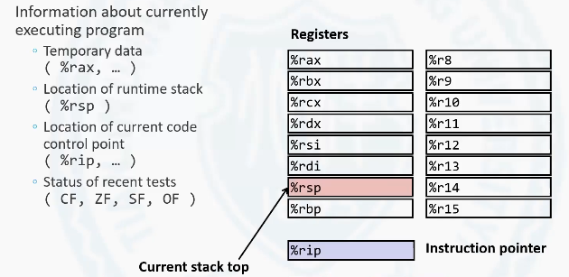
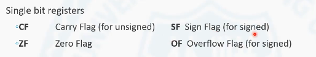
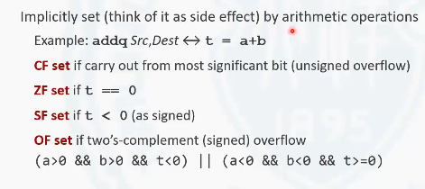
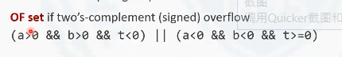

# 3.6.1 条件码

条件码是处理器中的一些特殊标志位.

首先从程序员的角度上去看一下处理器。假设一个程序正在处理器上运行, 那么这个程序当前的状态,可以通过处理器中的一系列信息可以表示出来。那么这些处理器就是所有对于程序员可见的处理器, 以及一些标志位组成的。

比如说我们之前所谈到的, 16个通用寄存器。在寄存器中大量的寄存器被用于表示当前程序中所使用到的一些局部变量, 

除此之外，还有两个特殊的计算器，一个是`rsp` 寄存器，它表示当前这个程序运行时的栈的顶部地址。还有一个寄存器，就是程序计数器。在x86-64位系统中叫做`rip` 寄存器。这个寄存器中存放的是当前所执行的这条指令的下一条指令, 也就是接下来要执行的那条指令的地址。

<!-- move -->

除了这些信息之外,还有一些标志位,也用来表示当前处理器的状态,那么这些状态也是非常重要的,如果我们能让处理器正常的工作，正常的执行程序，这些标志位是必不可少的。这些标志位呢存放在处理器的一个叫做标志记存器的专用寄存器中,标志寄存器是不能通过汇编语言指令直接访问,但是它可以间接的去修改标志寄存器和间接的访问标志寄存器。

标志寄存器中,包含着一些比特,其中每个比特都有他各自的含义。在这里面我们主要讨论最重要的四个标志位。这四个标志位我们也把它叫做条件码, 分别是CF, ZF, SF和OF.

`CF` 是表示进位标志位。它是对于无符号数而言的, 也就是对于无符号数的两个数进行运算, 如果产生了进位，或者是借位, 这个时候, `CF`这个标志位会被置1。无符号数出现进位或者借位，就意味着无符号运算出现了溢出。

`SF`表示的是当前指令运算的结果，它的符号也就是这位和当前指令运算后得到的结果的符号位是一致的。如果运算后的结果为非负数, 那么`SF`标志位为0, 如果为负数, `SF`标志位为1。所以我们可以看到`SF`这个标志位是针对于有符号数而言。

第三个标志位叫做`ZF` , 它是零标志位。当运算的结果为零的时候，结果的标志位会被置1。

最后一个标志位`OF`。溢出标志位, 溢出标志位是针对于有符号数运算而言的。有符号数运算, 它有可能出现溢出，而不是进位。那么溢出呢，有一些条件我们可以判断它。如果对于这两个数，如果把它看作是有符号数，它在运算的时候产生了溢出。那么溢出标志位则会被置位。标志位被置位有两种方法可以进行，一种叫做隐式置位。另外一种叫做显示置位。隐式之位是通过运行一些算术运算指令之后, 可能会对这些标志位进行置位。

## 隐式置位(`Implicitly set`)

比如说我们这有一条指令`addq` 。元操作数和目标操作数进行运算。这实际上就是做了一个两个操作数之间相加，并且把它的和复制给目标操作数这样一个过程。那么每当执行一个算术运算或者逻辑运算指令的时候, 都有可能导致这些标志位的变化。
也就是这个指令运算后的结果，会影响标志计算器。

那这里边可能会有一个最大的问题就是, `ZF`标志位比较容易理解。那么剩下这些标志位与有符号数和无符号数有关但是在处理器去执行汇编指令的时候, 它操作的是寄存器，操作的是内存。寄存器和内存中到底存放的是有符号数还是无符号数呢？实际从汇编语言的角度上是不清楚的。那么这些标志位怎么去置位呢？标志位在置位的时候，实际上是把结果既看做了有符号数，也看做了无符号数。也就是, 假设我两个寄存器中的值相加, 如果是无符号数，它会不会有进位？如果有进位`CF` 就会被置位。如果把这两个寄存器中存放的数字看作是有符号数。那么它会不会溢出？如果会溢出, 它的溢出标志位就会置位。那么还要看最高位，如果是无符号数无所谓。如果要是把这个数看作是一个有符号数，如果它前面有符号位, 那还要根据符号位的值去置`SF` 。也就是说最后运算出的结果，既把它当做无符号数，也把它当做有符号数。 无符号数如果要是相关的标志位满足条件的话，会置位. 有符号数，满足相关条件的话，对应的标志位也就是条件码会被置位。

溢出标志位，它在什么情况下会被置位?实际这个问题在之前已经讨论过了。就是当a 和 b 都大于零的时候, 运算的结果小于0。这个时候是必然会被置位的。另外还有一种情况就是a 和b 都小于0, 运算的结果大于0, 这个时候溢出标志位也会置位。也就是溢出的条件就是, 两个加数, 它的符号位。和和的符号位不同, 这个时候就会被置位。

当然除了加法运算之外, 减法运算、乘法运算以及其它的一些位运算每经历一条指令, 这条指令的效果都会导致这些标志位被置位或者是被复位，也就是被置为1或者置为0。

那么在算术运算和逻辑运算指令中，有一条指令是不会影响条件码的, 这条指令就是地址计算指令。(` NO set by leaq instruction`)也就是地址计算这几个指令执行之后，条件码是不会有任何变化的。不管它是否进位是否溢出，是否为0等等。

## 显式置位(`Explicit set`)

