# 3.6.5 使用跳转指令实现条件分支

这节探讨C语言if else 语句在使用汇编指令表示是采用什么样的方式去表示

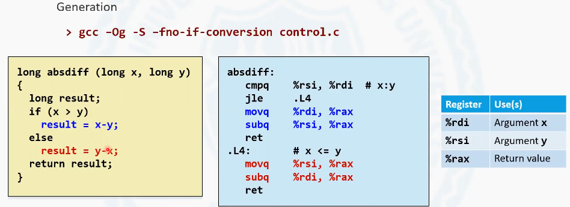

这有一个c 源的代码片段, 它定义了一个函数。这个函数的目标是计算了x 减y 的绝对值, 传入了两个参数x 和y , 如果x 大于y,  就用x 减去y , 否则就用y 减去x 。其实就是去算x 减y 的绝对值, 这样的一个程序，我们通过上面的这样一个指令，把它翻译成汇编指令。

```shell
gcc -0g -S -fno-if-conversion control.c
```

<!-- more -->

rdi存放的是x的变量，rsi存放的是y 的变量，rax存放的是返回结果.进入这个函数之后，首先把x 和y 做了一个比较。如果x小于等于y 则跳转到.L4. 跳转到L4的时候做了一件事, 把rsi也就是y放到了iax中, 然后用rax 减去x 的值, 然后差放到rax 里, 函数返回。
如果不是小于等于，那么就是把x 的值放到rax里, 然后用r ax 去减去y 的值，最后结果存到rax 里，然后过程返回。

如果使用了一个c 语言的goto语句的版本，可以让我们更清晰的去看到条件跳转语句在刚才的汇编语言中的这个跳转分支的过程发挥了一个什么样的作用。


当然在c 语言中还有一种可以实现简单的条件分支的方法, 就是采用表达式中的三目运算符。


# 3.6.6 使用条件数据传输语句实现条件分支

介绍另一种实现高级语言条件分支语句的形式, 就是使用条件数据传输语句来去实现。


条件数据传输语句其实也可以认为是一个条件赋值语句。它本质上是实现了这样的一个过程, 就是根据条件码的具体状态来决定是否把源操作数中的值, 赋值到目标操作数中。
这个过程和传统的move指令非常相似, 只不过是他在move之前需要判断一下条件码。
如果条件码不符合要求，相当于这条指令什么都不做，继续向下执行。如果符合要求就进行复制, 这就是条件数据传输指令的基本功能。

为什么我们还需要引入条件数据传输指令？这是因为条件跳转指令本身具有很大性能上的问题。这个其实涉及到我们处理器体系结构中一个非常重要的技术，叫做流水线技术。现代处理器中都包含着流水线, 流水线技术可以实现对于指令执行的加速, 而且这种加速的效果是非常可观的。但是对于流水线来讲，它需要进行指令的预取, 通常的一个预取策略就是顺序取值。如果遇到跳转指令，那么对于流水线来讲会具有更大的挑战。因为流水线无法判断当前这个语句是否真正进行跳转, 尤其是条件跳转，因为还没有计算出条件的结果，所以流水线没有办法去计算到底是否完成跳转。所以这样就引发了一个问题，就是条件跳转语句其实对于流水线的指令预取是具有破坏性的。因此, 跳转语句本身对于流水线来讲会构成巨大的性能上的挑战, 但是条件数据传输语句将不会出现这种情况, 因为条件数据传输语句不需要实现跳转。

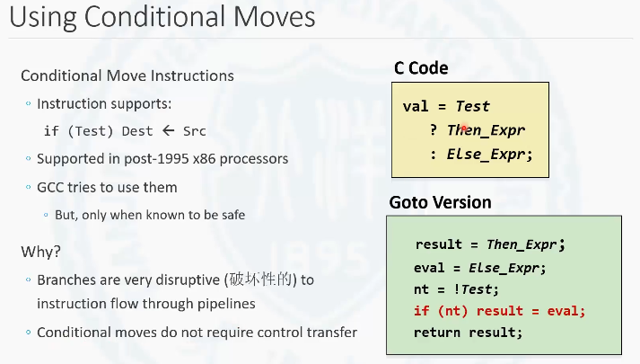

比如说前面我们谈到的这个三目运算符的例子。如果使用的是条件跳转语句，那么就会分成两个语句块。当不满足条件的时候，会跳入else 这个语句块会执行, 这样就会出现一个跳转。那如果要是采用条件数据传输语句，它怎么去执行的呢？它会首先把then的这个表达式和else 的这个表达式都提前计算出来, 接下来去判断一下是否满足条件。
如果满足条件就不进行条件数据传输语句进行复制。如果不满足条件，就把else的结果赋值给最终的结果。注意标红色的这样的一条语句, 在汇编语言指令中使用一条条件，数据传输指令就可以达到这样的一个效果。所以从宏观上看, 这个汇编指令本身都是顺序执行的, 不存在分支和跳转, 这样呢就可以对流水线进行一个优化。使用条件数据传输语句虽然会在前面增加了一些计算量, 但是由于他对流水线进行了优化, 所以流水线性能的优化要高于前期计算所消耗的代价, 所以整体上的优化效果仍然是明显的。

下面来看一个例子


计算机会把x 减y 的值计算出来，放到rax 寄存器里。把y-x 的值计算出来，放到rdx 计算器里, 然后它再去比较x 和y 之间的大小。cmovle就是一个条件数据传输指令, 它和条件跳转指令的后缀和set 这一组指令的后缀的用法是相同的。它的意思是如果前面的这个比较是小于等于的话，会把rdx 赋值到rax寄存器中。如果要是大于rax 寄存器的值，保持原状也就是说这条指令不做任何的工作。这样我们看在整个的这个过程中，就消除了分支跳转, 对流水线进行了优化。

## 不适用与条件数据传输指令的场景


1. 两个表达式计算量都非常大, 这时计算开销要远大于对流水线的优化
2. 表达式具有一些临界的风险情况.
3. 计算中会出现一些副作用. 如两个表达式冲突时.

# 3.6.7 (1) do-while循环

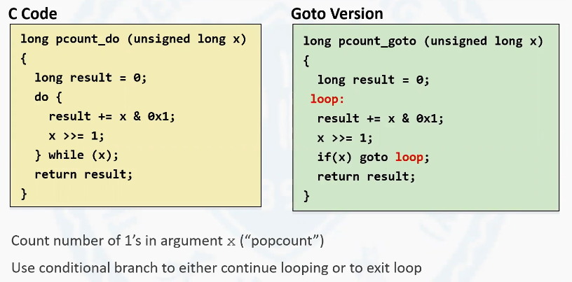

在通过之前条件分支的讨论可以知道。在汇编指令中, 条件跳转, 等价于c 语言中的一个if 的条件判断加goto语句。


1. 位移操作数只有1位的时候, 唯一一个操作数为目标操作数, 移位量为1.
2. rep指令是一个字符串操作指令, 这里相当于在goto和ret之间插入一个空指令, 作用是优化x86处理器的流水线功能.

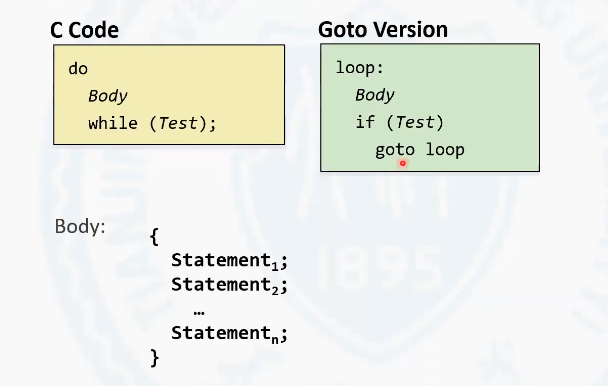

# 3.6.7(2) while循环

看图就可以了.


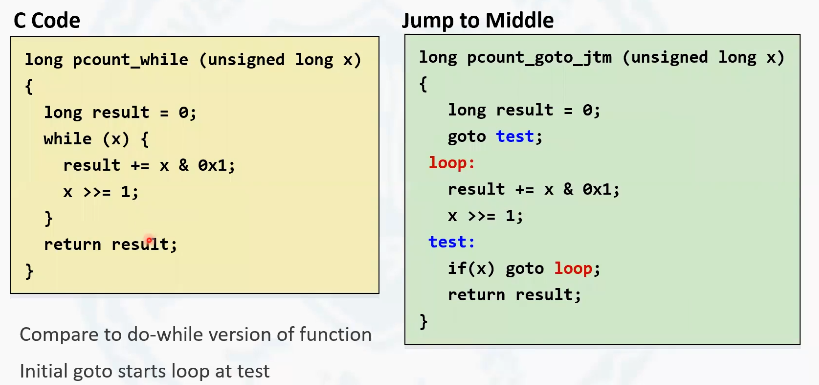

使用`-o1`编译选项.

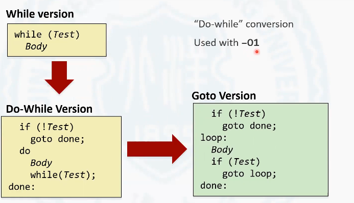

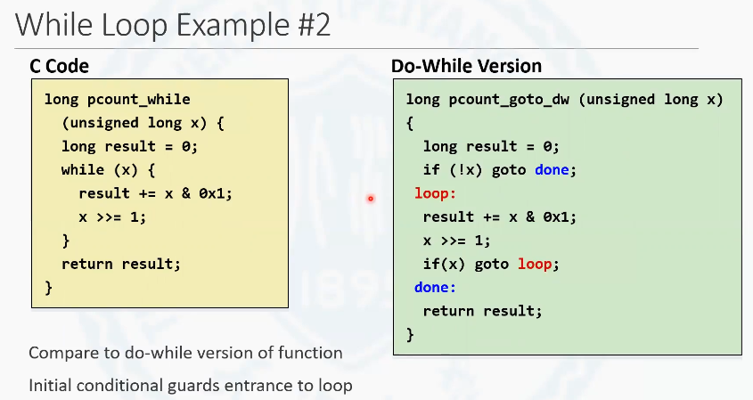

# 3.6.7 for循环


将for循环改造成while循环


将for循环转化成等价的while循环


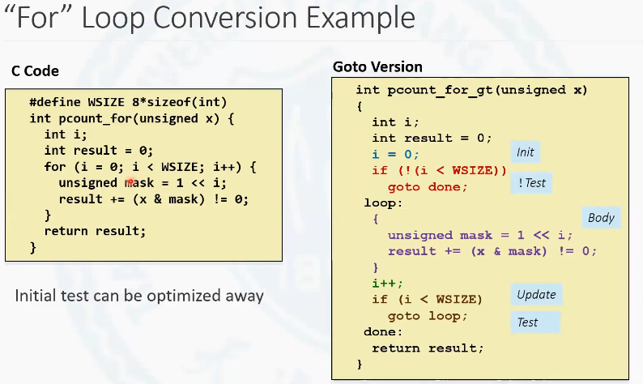

优化后

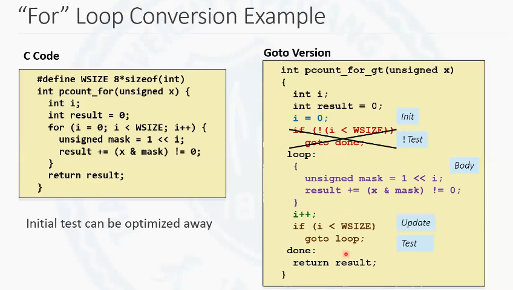

# 3.6.8(1) switch 语句的机器级实现

switch 语句可以实现的所有功能都可以被条件分支语句，也就是类似于if else , if 的一种形式来表达。既然switch 语句有它的等价表示方式, 为什么在高级语言中还定义switch 这样的一种特殊的语法呢？这是有特殊原因的。

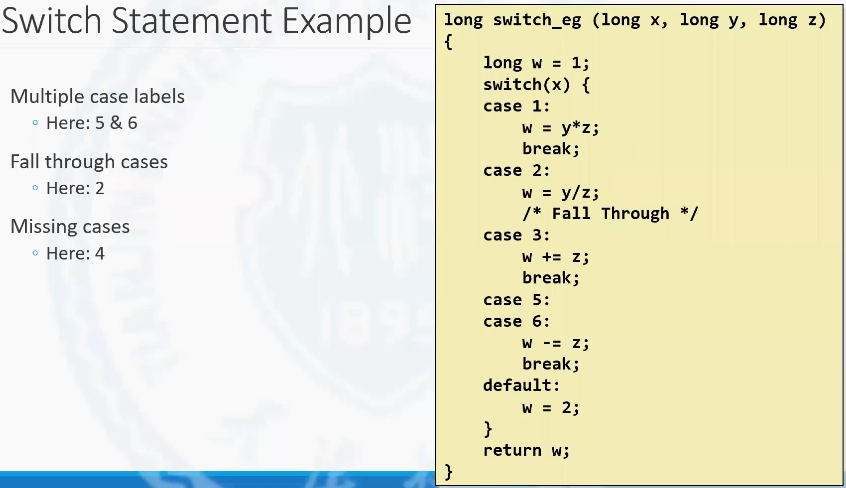

## 基于跳转表的switch语句实现

switch是语句在机器级实现的时候，主要是基于了一个跳转表的数据结构来实现。具体如下

Jump Table是一个数组, 数组中的每一个元素都是一个地址。这个地址指向的是对应的case 语句块的起始地址。switch语句在工作的时候是根据变量的值去跳转表中找到对应位置的元素, 从对应位置的元素中，将某个数组元素的值也就是跳转的目标地址取出来, 然后执行一条跳转语句，跳转到真正目标入口的语句块的起始地址位置上。


和if else语句相比, switch语句有一个非常大的优势, 就是在整个这个过程不管跳转到哪一个目标语句块, 它所花费的时间都是固定的, 也就是说它的时间复杂度是一个常数类型。

而if else 语句, 如果想执行if else 语句的最后一个语句块, 必须是先做了前n 个语句块的判断之后, 才能够执行。这就说明if else语句查找到目标并进入目标语句块进行执行的时间复杂度是n 。

switch语句利用跳转表这样一个结构，将时间复杂度转换为常数。所以, switch语句的变量必须是整数. 因为只有这个变量是整数，它才能作为查找表的下标, 去进行查表的这样的一个操作。

# 3.6.8 (2) 间接跳转


变量的判断主要使用了一个判断的指令cmp去判断rdi和6的大小, 6是一个立即数。接下来用ja指令去进行跳转, ja 是用于无符号数大于的判断。
但是x 是一个有符号数。为什么要使用一个无符号数的指令去做判断？因为在case 语句中, 有效范围是从0到6范围内。大于6和小于0的数都会进入到default 这样的一个语句块里,那如果将rdi 的范围换算成无符号数的话，可以认为rdi 就是一个小于等于6的一个无符号数, 因为在有符号数转换成无符号数的时候，负数会被转换成大的一个正数。所以通过ja 这样一条指令，就既可以排除掉小于零的数也可以排除掉大于六的数字。如果是大于6, 指定跳转到某个固定的位置, 否则执行间接跳转。

## 间接跳转与直接跳转


可以根据跳转目标的不同, 将跳转划分成两种类型, 一类叫做**直接跳转**。直接跳转就是在去做跳转的时候,  跳转的目标是一个确定的位置, 那么这种跳转就叫做直接跳转。比如下图中的jmp .L8, 不管在什么情况下，只要执行这条跳转语句，只要它发生了跳转，它就一定会跳转到某个确定的位置。


另外一种就是**跳转到某个不确定位置的跳转叫做间接跳转**。不确定的位置并不是计算机不知道跳转的确定位置, 而是在执行到这条指令之前是无法提前预知的。地址是基于某个变量去计算出来的。在这里面上图中的`jmp *.L4(, %rdi, 8)`就是一个间接跳转。这个间接跳转是基于rdi 中的值来去计算出跳转的具体目标。
后边这一部分`(, %rdi, 8)`可以认为就是寻址方式的那个4元组, 就是的D(R~b~, R~i~, S)。
L4是一个地址, 是跳转表的地址，跳转表是在编译器编译的时候为我们生成的一个固定的只读数据, 就是在内存中分配出一个区域，这个区域不可被修改。但是它内部的变量已经初始化。
跳转表的起始地址的标号是L4, 每个数据的数据宽度是八字节, 对应的每个数据的值在后面也定义了就是对应的标签, 标签就是一个地址, 地址本质上也是一种类型的数据。
在L4的这个表中,一共包含着7个元素, 7个元素，每个元素都对应着一个标签，也就是都对应着一个地址, 这个地址就是x 等于0的跳转到x 等于6的跳转的目标地址。

rdi和8决定了rdi ，就是这个查找表要访问的下标. 8表示查找表中每个元素的大小, 可以看到这个查找的地址就是L4为起始地址,  加上下标乘以元素大小的偏移量所查到的就是对应这个r d i 的这个下标的地址。最后前面有一个`*`是把这个地址中的数据取出来作为跳转语句的目标地址。比如说rdi是1, 最后计算后的地址就是L4中的第1个元素的起始地址。
从它中间取出来的值就是L3, 跳转语句就是跳转到L3这个标签所指向的位置。

因为这个查找表只有7个元素，所以它只是支持x也就是rdi变量, 从0到6范围内的变化, 小于零和大于6都会跳到某个默认的位置上去, 这个默认的位置就是对应的default . 

# 3.6.8(3) switch语句示例分析

跳转表和case语句块的映射关系

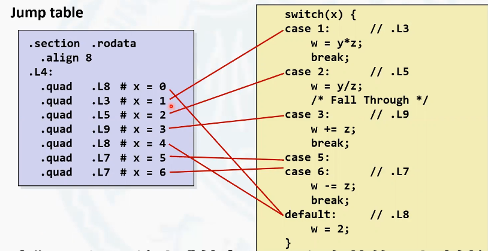
在整个的这个条件变量里, 0和4是没有所对应的case语句块的, 所以0和4都指向了default 这个语句块, 除此之外，其他的跳转表中的值都是指向了对应的语句块的位置, 可以看到的是x=5和x=6的时候，它指向的语句块都是L7这个语句块, 所以case5和case6它有相同的语句块的处理。

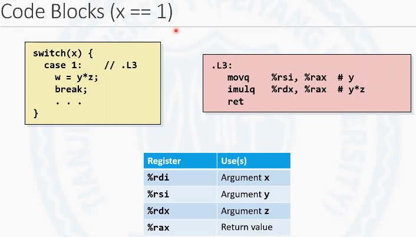

## 有break语句的情形

当x=1的时候，会跳转到L3这个语句块里. 在L3这个语句块里, 它首先把rsi复制给rax, rsi中存放的是参数y的值。第二部做了一个乘法y*z, 结果存到rax 中。由于在函数中，w 是作为最后的返回值出现的, 所以switch语句后也不出现对任何w的处理, L3在计算完成后，由于有break语句，它也不会再执行其他的语句, 调用了过程返回指令导致函数返回。


## 落下(`Fall-Through`)的情形

case2中, 首先会做一个 `y/z` 的操作, 完成之后，它会继续执行到case3的语句, 做w+=z的操作.在之前可以看到, 对于把w赋初值为1(`long w=1`), 在进入switch语句之前。
并没有进行, 原因是并不是所有的语句块都需要有把w赋值为1的这样一个操作, 比如说case2这个语句块就不需要对w赋初值, 因为在case 2这个语句块中为w 再一次做赋值。所以w 等于1这个赋值并不是在所有的语句块中都需要。

所以w 等于1是不会在switch 语句之前去做这样一个复制的。因为这样做会浪费指令, 导致程序性能的下降。w=1赋值是按需出现的。比如说在case3的时候, 计算w+=z时，之前是需要w先去赋初值的。所以它在这个位置case 3的时候，才会去先把w赋值成一。
但是case2的时候，由于它不需要赋初值，所以给`w=y/z`之后，紧接着就需要跳转到merge语句块,  因此在case3中需要分成两个语句块。

case2完成后会跳转到merge, case3完成后也会顺序执行到merge语句块,

下图为case3和case2 在一起的汇编代码


 ## 共用标签的情形


# 3.6.8(4) 对switch的进一步探讨


## 查找表的局限

switch 语句使用查找表去进行实现的时候, 会有非常大的一个性能上的提升。但是查找表本身也具有一定的局限性。

前面例子中所有的case 语句中值都比较小, 是从0到6这样的一个范围内, 那如果case 语句中的值都比较大的时候怎么办呢？如果仍然是从零作为查找表的起始地址到10006。作为一个结束的这样的一个元素。这个查找表的规模就会变得非常大, 而且10000之前的这些查找表中的地址存储的都是相同的，标签都是指向default 。这样就会变得没有意义, 使得查找表大量的数据存储的，实际上都是没有意义的数据, 或者说查找表在所引起的空间复杂度的提高所得到的这个效果要远远大于性能上的提升。

## 解决方法

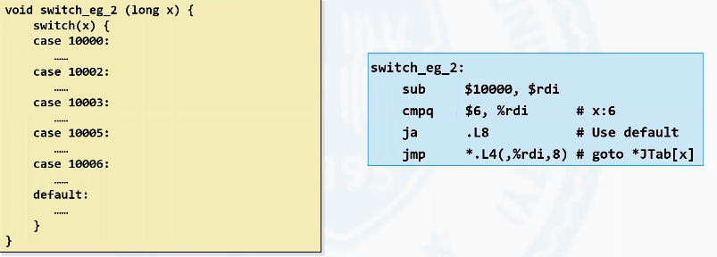

第一种解决方法, 是观察一下case 语句它在数轴上的取值是不是相对密集的。如果相对密集比如说上面这个例子是从1万到10006, 它在数轴上仍然相对密集, 只不过是它相对于0, 有了一个整体的偏移。编译器会首先去减去一个固定的偏移量, 使得最后case 语句的这些值处在从零开始的每个某个很小的范围的区间内。这样仍然可以去很有效率做查找。在这个例子中，它是从10000到10006, 可以把它近似成为把x 减去10000，然后继续把减完的这个结果和6去比较，因为它就变成了一个从0到6的这样一个范围, 然后接下来仍然可以使用间接跳转去进行查表来去实现。

那如果在数轴上排列不密集呢?


更普遍的一种情况处理起来就更加的复杂了, 就是数据的范围是很大。值很大, 而且这些数据在数轴上分布的不密集, 即这些数值在数轴上的分布非常稀疏。

这个时候switch语句通过编译器去实现的时候，就不是以查找表的方式来去实现了。
而是以二分搜索的方式来去实现。二分搜索，这是一个数据结构中提供的概念。由于我们的case 语句都是一些孤立的值, 这些值编译器可以给他们进行排序，进行一个二分搜索，或者叫做二分查找。编译后的结果近似等价于这样的一个if else 语句的一个嵌套的过程。
注意这个是if 语句中间嵌套if else , else一句话中间再嵌套if else 。使用二分搜索的方式, 
去查找对应的语句块的时间复杂度是log~2~n。如果采用if else if ,期望的时间复杂度是n 也就是一个线性时间复杂度。

即使对于case 中的值比较稀疏的这样的一个情况, 编译器仍然可以提供比较高的查找效率。而这个查找要比简单的，if else if 的这样的一种查找要快。
所以说这就是switch语句它仍然存在的价值。所以switch 语句是基于值进行查找的。
所以可以进行一定程度的优化。编译器足够的聪明，足够的智能, 可以根据不同case 语句的值对整个switch语句进行不同程度的优化. 在C语言c++语言中。在高级语言中，如果有switch 这样的语法,基本实现都是类似的。