# 3.6.5 使用跳转指令实现条件分支

这节探讨C语言if else 语句在使用汇编指令表示是采用什么样的方式去表示

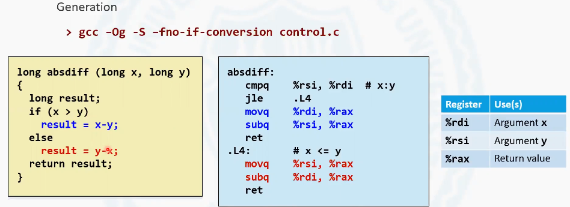

这有一个c 源的代码片段, 它定义了一个函数。这个函数的目标是计算了, x 减y 的绝对值, 传入了两个参数x 和y , 如果x 大于y,  就用x 减去y , 否则就用y 减去x 。其实就是去算x 减y 的绝对值, 这样的一个程序，我们通过上面的这样一个指令，把它翻译成汇编指令。

```shell
gcc -0g -S -fno-if-conversion control.c
```

<!-- more -->

rdi存放的是x的变量，rsi存放的是y 的变量，rax存放的是返回结果.进入这个函数之后，首先把x 和y 做了一个比较。如果x小于等于y 则跳转到.L4. 跳转到L4的时候做了一件事, 把rsi也就是y放到了iax中, 然后用rax 减去x 的值, 然后差放到rax 里, 函数返回。
如果不是小于等于，那么就是把x 的值放到rax里, 然后用r ax 去减去y 的值，最后结果存到rax 里，然后过程返回。

如果使用了一个c 语言的goto语句的版本，可以让我们更清晰的去看到条件跳转语句在刚才的汇编语言中的这个跳转分支的过程发挥了一个什么样的作用。

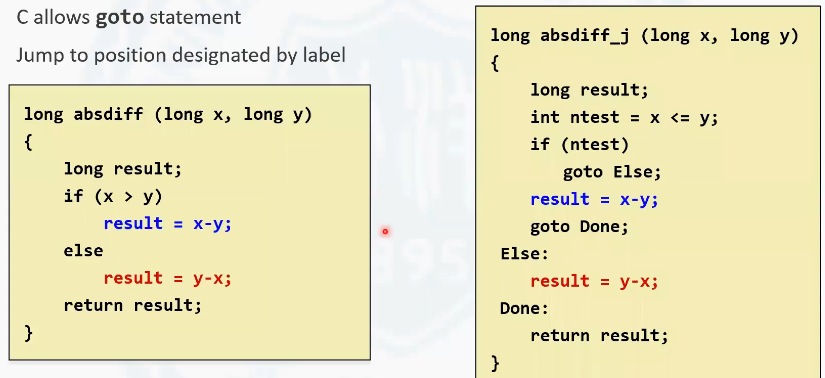

当然在c 语言中还有一种可以实现简单的条件分支的方法, 就是采用表达式中的三目运算符。

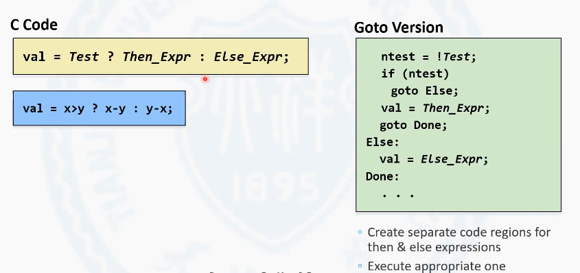

# 3.6.6 使用条件数据传输语句实现条件分支

介绍另一种实现高级语言条件分支语句的形式, 就是使用条件数据传输语句来去实现。

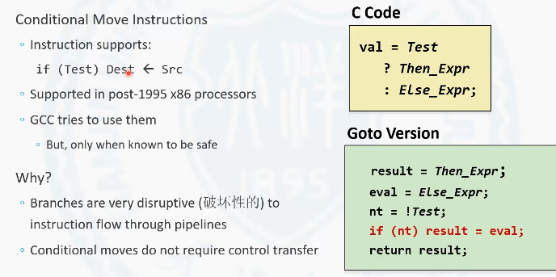

条件数据传输语句其实也可以认为是一个条件赋值语句。它本质上是实现了这样的一个过程, 就是根据条件码的具体状态来决定是否把源操作数中的值, 赋值到目标操作数中。
这个过程和传统的move指令非常相似, 只不过是他在move之前需要判断一下条件码。
如果条件码不符合要求，相当于这条指令什么都不做，继续向下执行。如果符合要求就进行复制, 这就是条件数据传输指令的基本功能。

为什么我们还需要引入条件数据传输指令？这是因为条件跳转指令本身具有很大性能上的问题。这个其实涉及到我们处理器体系结构中一个非常重要的技术，叫做流水线技术。现代处理器中都包含着流水线, 流水线计数可以实现对于指令执行的加速, 而且这种加速的效果是非常可观的。但是对于流水线来讲，它需要进行指令的预取, 通常的一个预取策略就是顺序取值。如果遇到跳转指令，那么对于流水线来讲会具有更大的挑战。因为流水线无法判断当前这个语句是否真正进行跳转, 尤其是条件跳转，因为还没有计算出条件的结果，所以流水线没有办法去计算到底是否完成跳转。所以这样就引发了一个问题，就是条件跳转语句其实对于流水线的指令预取是具有破坏性的。因此, 跳转语句本身对于流水线来讲会构成巨大的性能上的挑战, 但是条件数据传输语句将不会出现这种情况, 因为条件数据传输语句不需要实现跳转。

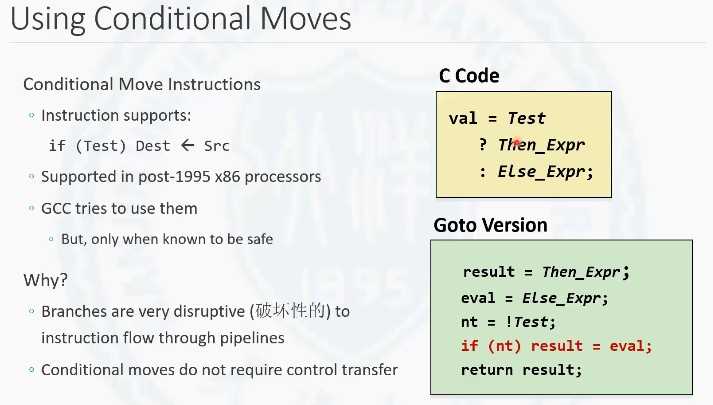

比如说前面我们谈到的这个三目运算符的例子。如果使用的是条件跳转语句，那么就会分成两个语句块。当不满足条件的时候，会跳入else 这个语句块会执行, 这样就会出现一个跳转。那如果要是采用条件数据传输语句，它怎么去执行的呢？它会首先把then的这个表达式和else 的这个表达式都提前计算出来, 接下来去判断一下是否满足条件。
如果满足条件就不进行条件数据传输语句进行复制。如果不满足条件，就把else的结果赋值给最终的结果。注意标红色的这样的一条语句, 在汇编语言指令中使用一条条件，数据传输指令就可以达到这样的一个效果。所以从宏观上看, 这个汇编指令本身都是顺序执行的, 不存在分支和跳转, 这样呢就可以对流水线进行一个优化。使用条件数据传输语句虽然会在前面增加了一些计算量, 但是由于他对流水线进行了优化, 所以流水线性能的优化要高于前期计算所消耗的代价, 所以整体上的优化效果仍然是明显的。

下面来看一个例子

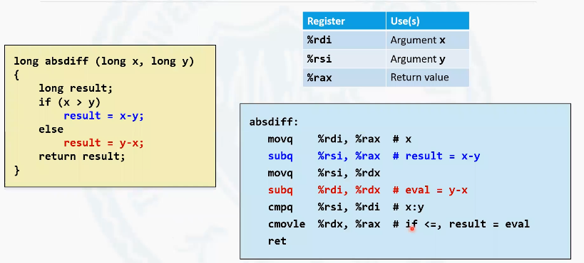

计算机会把x 减y 的值计算出来，放到rax 寄存器里。把y-x 的值计算出来，放到rdx 计算器里, 然后它再去比较x 和y 之间的大小。cmovle就是一个条件数据传输指令, 它和条件跳转指令的后缀和set 这一组指令的后缀的用法是相同的。它的意思是如果前面的这个比较是小于等于的话，会把rdx 赋值到rax寄存器中。如果要是大于rax 寄存器的值，保持原状也就是说这条指令不做任何的工作。这样我们看在整个的这个过程中，就消除了分支跳转, 对流水线进行了优化。

## 不适用与条件数据传输指令的场景

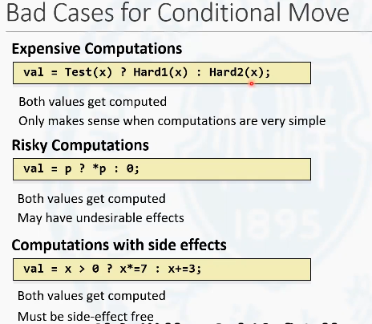

1. 两个表达式计算量都非常大, 这时计算开销要远大于对流水线的优化
2. 表达式具有一些临界的风险情况.
3. 计算中会出现一些副作用. 如两个表达式冲突时.

# 3.6.7 (1) do-while循环

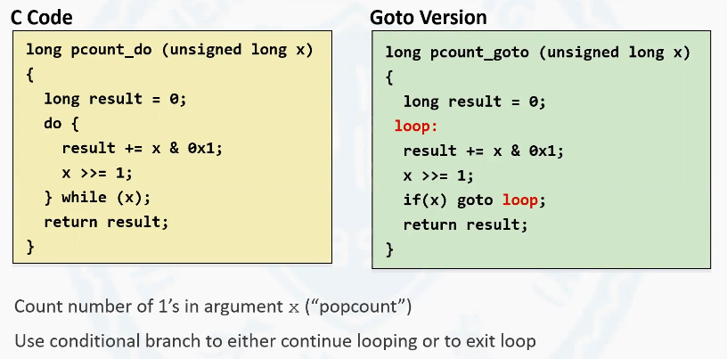

在通过之前条件分支的讨论可以知道。在汇编指令中, 条件跳转, 等价于c 语言中的一个if 的条件判断加goto语句。

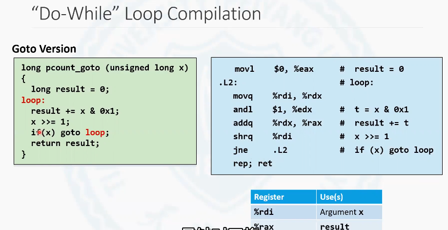

1. 位移操作数还有一位的时候, 唯一一个操作数为目标操作数, 移位量为1.
2. rep指令是一个字符串操作指令, 这里相当于在goto和ret之间插入一个空指令, 作用是优化x86处理器的流水线功能.

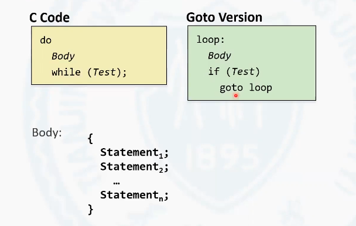

# 3.6.7(2) while循环

看图就可以了.

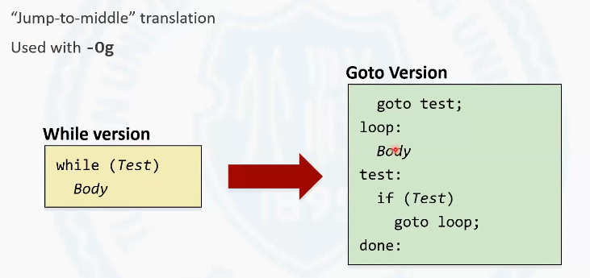

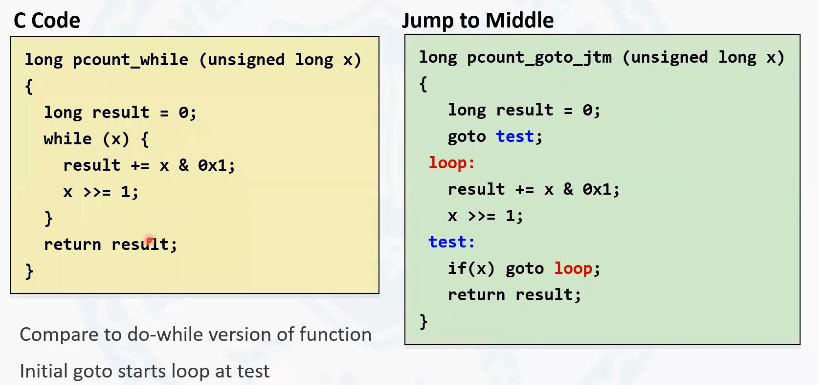

使用`-o1`编译选项.

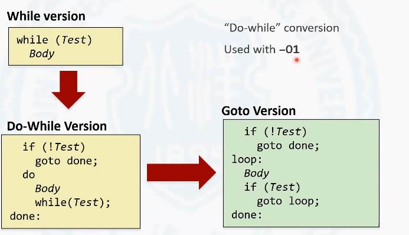

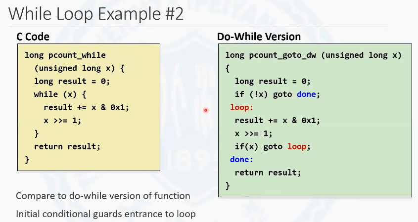

# 3.6.7 for循环

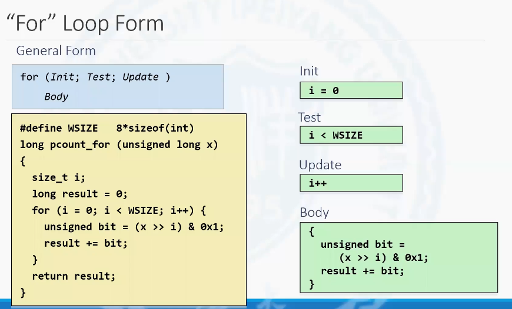

将for循环改造成while循环

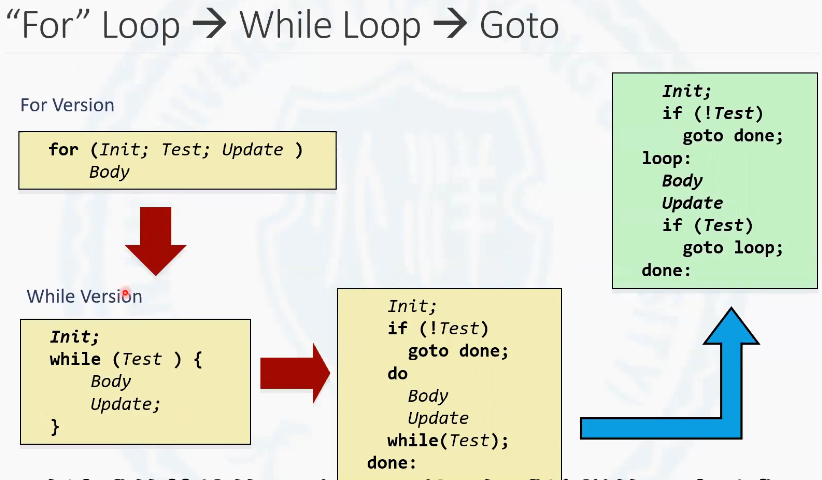

将for循环转化成等价的while循环

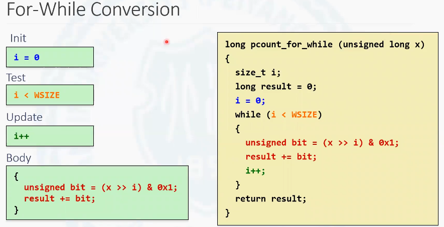

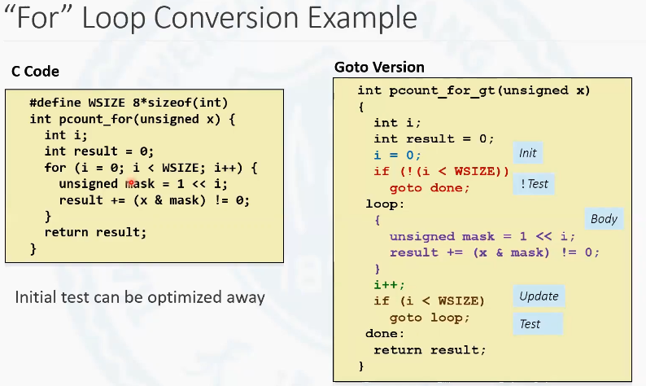

优化后

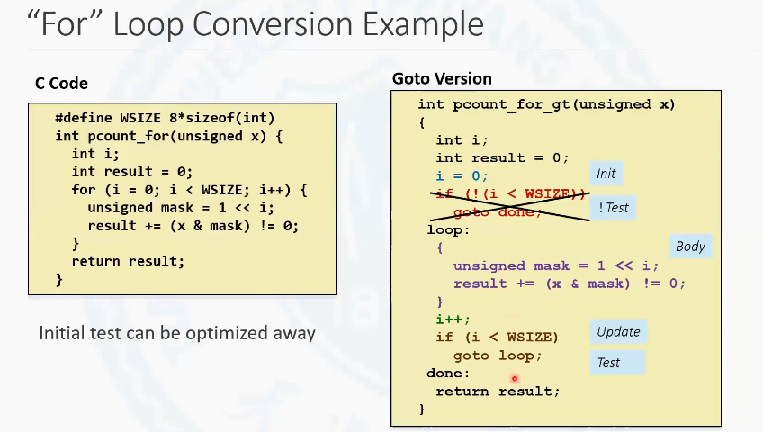