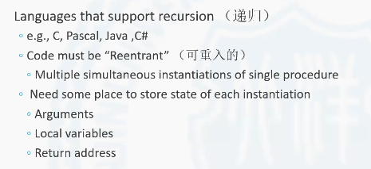
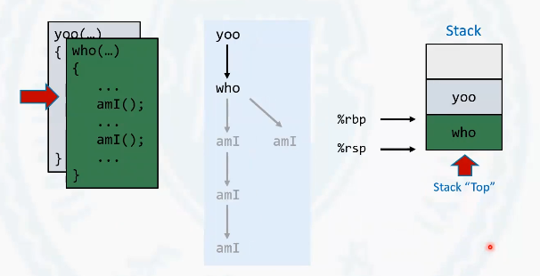
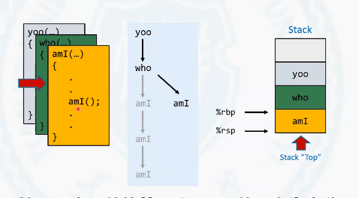

# 3.7.5(1) 栈上的局部存储

## 语言特性角度的过程存储管理问题

接下来我们讨论一下过程中的存储管理问题。首先我们先从语言特性的角度上去分析这个问题。

<!-- more -->

现今大多数的编程语言都是支持递归的, 比如说C语言，C++，java c# 等等。这些可以支持递归的语言的一个最基本的要求是需要代码可以重入, 也就是一个过程或者一个函数在调用没有返回之前被再次调用, 能够实现可重入就决定了这个代码内部所使用的局部变量是不能在各个相同的过程调用的实例中共享的, 也就是这个过程在同一时刻可能调用了多次，但是每个过程都有他自己的过程的实例。内部的状态在每个过程之间也是不相同的，也就是它使用的一些变量之类的也是不同的。

这就需要有一个特殊的空间为每个过程实例去存储它的状态。这个状态都包含什么呢？比如说这个过程在调用的时候，它的参数, 可重入的每个过程可能它调用的参数都是不同的, 所以参数就是表示这个过程的状态的情况的一个因素。除此之外，过程内部所定义的一些局部变量也用来描述过程的状态, 还有就是返回地址。虽然过程可重入，但并不意味着每个过程的返回地址都是相同的位置。它也是过程在去运行的时候，这个过程实例的一种状态。

##  过程调用与栈

那么基于这样一个特性，我们在结合着栈这样的一个数据结构，可以有一个什么样的结论呢？

过程的状态啊本身是有一个生命周期的概念。就是当过程调用的时候, 这些过程的状态被创建出来，用于存储过程的状态。当过程返回的时候，这些状态就可以释放掉。它存在着这样的一个生命周期，就是调用时创建返回时销毁。

从另一个角度上看过程的调用是什么样子呢？是调用者(`caller`)。在内部调用被调用者(`callee`), 就是一个过程去调用另一个过程。那被调用的过程, 是要先于调用者返回。

换句话说，多个过程嵌套调用。最后一个返回的过程应该是最开始的那个过程。最先返回的过程一定是最后被调用的过程。这样的一个特性和栈的特性是非常相似的。因为**栈的特点也是先入后出后入先出**。

了解了过程调用的特点和栈的特点，把它们结合在一起，就可以发现。将栈与过程调用结合在一起是一个非常完美的结果, 可以把每个过程实例的状态存储在栈上。因为它都是先入后出的特点。所以栈可以和过程非常完美的结合在一起。存储在栈中的这些过程的状态。在这里边叫做帧("Frames"), 也把这个帧叫做栈帧。

## 实例 —— 栈帧的形成和销毁

这里面我们给出了一个程序, 这个程序由中包含着3个函数。就是yoo, who和amI函数. 它们之间可以形成这样的一个调用关系, 就是在yoo函数中调用who函数，在who函数中要做两次amI函数的调用。第一次amI函数的调用会进行一个递归。递归一共有3层, 然后返回. 返回后再进入第二个amI的函数, 但是这个函数不会形成递归, 然后返回。

### 实例过程分析

**PS: 每段文字所对应的图片都是上方的第一张图片**

首先程序进入到yoo函数。这个时候在栈中会为yoo函数分配一个栈帧。`rsp`指向的是栈的顶部元素，目前指向的也就是yoo元素的顶部的位置。

rbp 是在某些情况下也是一个具有特殊作用的寄存器, 它用来去指向当前这个栈帧的底部。但是在最新版本的x86-64位gcc编译器中，rbp已经没有了这样的一个特殊作用。它只可以向其它寄存器一样啊，作为通用寄存器正常使用, 没有为它赋予特殊的功能。但是通过某些编译选项的设置，rbp 仍然可以让它指向栈的底部。

接下来在yoo函数中调who函数。进入who函数会为who函数分配一个栈帧。`rsp`和`rbp` 指向了who函数的栈帧顶部和栈帧底部。当然`rsp`指向的who函数的栈帧顶部也是整个栈的顶部。

在who函数中调用amI 函数在为amI 函数分配栈帧。rst 和rbp 进行了更新。amI 函数在第一次调用的时候要进行三次递归, 所以amI函数要重入3次，在栈上也是有对应的amI函数的三个栈帧。

当最内部的amI 函数开始返回的时候，这个时候栈中的相应的栈帧也要会被释放。
最后返回who函数.

这个时候开始调用who函数的第二个amI 函数再次为它分配栈帧。

这个amI 函数没有进行递归，直接返回回到了who函数。再一次栈帧释放。

who函数执行完成之后，who函数栈帧释放. 最后yoo函数执行完成之后，yoo函数的栈帧也会从栈帧释放。这就是栈帧与函数调用之间的这样的一个过程。