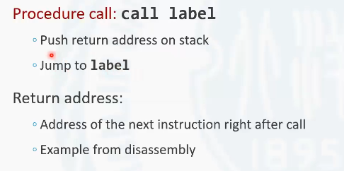
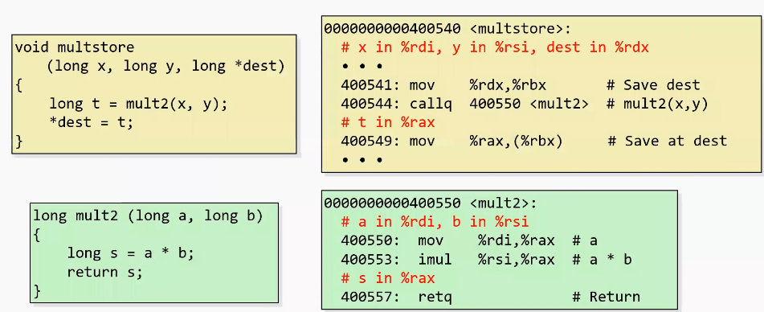

# 3.7.1 过程调用

过程对应于c 语言中就是指的函数。函数相当于是对一系列工作流程所进行的一个抽象, 那么函数调用在高级语言中是一个再常见不过的事情。

在这一部分主要讨论一下函数调用，也就是对应到汇编语言中的过程在机器级是如何实现的. 如下有两段代码

一个是P 函数，一个是Q 函数。我们可以看到在P 这个函数中, 调用了Q 这样的一个函数, 实现了一个函数的嵌套调用。在这样的一个嵌套调用中。计算机, 底层主要完成了哪些工作呢？

<!-- more -->

 首先第一点是完成了控制上的一个改变。那么这个过程我们把它叫做控制上的一个传递。也就是程序, 在这个代码片段中执行到某一个位置的时候, 打断了当前的顺序执行, 而切换到另外的一个代码片段进行执行。那在这个代码片段中执行结束之后又会回到刚才结束后的那条语句继续执行, 这个过程中就出现了一个控制上的一个变换, 确切的说就是代码执行地址之间的一个改变和切换。进入到一个新的过程后，从一个过程返回到另一个过程中间都有控制传递的问题。

第二个问题就是关于数据传递的问题。一个函数调用另一个函数可能需要传给这个函数中一些参数。那这样一些参数是通过什么样的方式，什么样的规则进行传入? 一个函数在返回的时候, 可能会将一些函数计算的结果以返回值的形式返回给原函数。那么在这里边还涉及到一个返回值的问题。所以第二个我们要讨论的就是一个数据怎么传入到过程中, 过程中的数据怎么在传回到原过程中。

第三个问题就是关于在过程内部如何去管理内存的问题。在这里主要讨论的一个管理内存的基本单位叫做栈针。这个概念在后面还会深入的展开。栈针主要是用来负责管理当前这个过程中所使用到的一些内存。这里就涉及到如何去管理这片内存。第一是这片内存空间如何去分配。比如说在这声明了一个数组，这个数组存储到哪里, 如何去保存数组中的数据。另外一个概念就是当过程返回的时候，它内部的使用的局部变量将会被销毁。那么这一部分局部变量如果有在内存中进行存储的，它又如何去完成这样的一个释放？
        这都涉及到内存管理的问题。

所以以上三方面就是控制的传递，数据的传递以及内存管理. 是我们在过程这一部分所讨论的三个主要的问题。而这些机制, 都是在机器级指令的这样的一个水平上完成的实现。这里讨论也是在汇编语言的水平上去讨论这样的一个高级语言的行为, 在底层是如何实现的。

**该章节全部内容针对x86-64**

# 3.7.2 栈的访问

## 栈

下面来讨论一种数据结构, 栈(stack)。栈是计算机中非常重要的一种数据结构。之所以首先去讨论栈这种数据结构, 是因为底层过程的调用是依赖于这样的一种数据结构的。换句话说由于这种结构的重要性, 因此导致了处理器本身是原生支持栈这样一种数据结构的, 它有针对于栈的特殊的操作指令。

栈是一片位于内存中的连续线性空间。栈底通常位于高地址。栈顶, 也就是数据进出的方向, 位于低地址。栈是从高地址向低地址方向生长的。在通用寄存器中有一个`rsp` 寄存器, 它有一个特殊的功能，就是用来存放栈顶元素的地址的。

## 栈的基本操作

对于栈有两个基本操作, 入栈和出栈。

### 入栈

入栈的指令是`pushq src`, `pushq` 是操作码, `src`是操作数。通常操作数只能是立即数或寄存器。它是一个单操作数的指令。这个指令它的工作可以分为三个步骤。

第一步, 是将操作数中的数据取出. 

第二步, 将rsp 的值减8，rsp 内部存放的是栈顶元素的地址, 减8标志着栈进行了一个生长，因为栈是向低地址方向进行生长。之所以减8，是因为push q 是一个64位的指令, 通过这个指令操作, 入栈的数据也是一个64位的数据, 也就是一个八字节的数据, 所以要进行一个减8的操作。

第三步, 将取出的src 中的数据存放到当前更新后的rsp所指向的内存位置中。这样就完成了一个入栈的操作, 入栈是一个原子化的操作，也就是通过这样一条指令就可以完成以下三个部分的内容。

第二个操作是出栈操作`pop` 。pop 是他的操作码, 它的操作数通常是寄存器, 不可以是立即数。pop 的工作方式也可以把它分解成三步。

第一步, 根据当前的rsp 寄存器中指向的地址，从这个地址中取出数据。

第二步，将取出的这个数据放入到对应的操作数中。

第三步, 将rsp 寄存器的值加8, 完成了一个栈的收缩过程。这里面可以看到, 没有任何删除数据的工作, `pop`指令只是将数据取出，放到操作数中。其实在对应的位置应该还保存着原先的数据. 但是我们要知道rsp指向的是当前栈的栈顶元素。通过rsp加8的操作，保证了栈的边界的一个收缩。这个时候就意味着虽然原先的数据在内存中还存在。但是它已经位于栈的外部了。换句话说，也就是这个位于栈的外部的内存已经被回收了, 未来栈再次生长的时候，将会覆盖掉这片空间。这样就完成了一个出栈的操作。

# 3.7.3 控制传递

接下来讨论一下过程调用的过程中是如何发生控制传递的. 

在过程调用中的控制传递，需要借助于之前所讨论到的栈这个数据结构, 用来实现过程的调用和传递。它主要所使用的两条指令是`call`指令和`return` ，也就是`ret` 指令。

`call`指令

这条指令是过程调用指令。它的操作码是call，他的操作数是一个标签，也就是对应的过程的入口地址。过程调用指令, 它在执行的时候主要进行了两个工作。首先是把过程调用后过程的返回地址压入栈中, 第二是跳转到标签所指定的位置执行下一条指令。

可以看到这里最重要的一个信息就是将返回地址首先压入栈中。那么返回地址是什么呢？实际上就是call这条指令，接下来的那条指令的位置, 也就是在call指令后面的那条指令，它所在的地址就是返回地址，也就是对应的这个标签的过程，执行完毕之后再返回，就是要执行这条call指令下边的那条指令所在的位置。

跳转的过程和跳转指令非常类似。它就是将程序的指令计数器也就是`rip`寄存器设置为了对应目标标签位置地址的值, 这就完成了这样的一个调整。

下面我们来看过程返回指令return ，也就是`ret` 指令。

它做的也是两件事。第一件事是从栈顶将返回地址弹出, 并以这个返回地址作为目标地址，再次完成一个跳转。
所以call指令和`ret` 指令都要进行跳转, 只不过是他们在跳转之前, 要对栈进行一些操作. call是要将返回地址入栈。`ret` 是要将返回地址出栈并进行调整。实际上我们还可以把`ret` 指令理解为返回地址出栈。出栈到哪个位置? 出栈到`rip` 寄存器中，这样`ret` 指令执行完之后，就会从新的位置加载指令。

## 下面是一个过程调用的实例

上面定义了multstore 函数。在multstore 这个函数里边调用了mult2 函数。mult2 函数就是将两个变量相乘，并且将结果返回。右面是这两条指令所对应的反汇编程序。

这里面要说明一些的就是由于反汇编工具，使用的是objectdamp , 所以它反汇编出来的汇编语言的操作码和之前所讲到的汇编程序的操作码有的时候会有一些细微的区别。比如说push 后面没有加q , 其实它是等加于pushq 的。move也是一样。这个callq 和retq 就等价于我们刚才的call指令和`ret` 指令, 只不过是它在写法上的不同，实际上它的本质是等价的。

首来看在multstore 中去调用mult2 这个函数发生了什么。它首先通过call指令指向了mult2 的标签。那么在机器指令级别mult2 这个标签会被转换成一个地址, 也就是mult2 这个指令的一个目标位置。当前状态下，假设`rsp` 寄存器也就是栈顶的地址为0x120即将要在执行call之前`rip` 这个寄存器的存储的地址应该是call这条指令的地址即`0x400544`, 这是在执行call这条指令即将要执行之前当前的处理器的状态。

当call指令开始执行的时候, rsp 寄存器就会由于call指令所导致出现了一个入栈的操作。入栈首先是要`rsp` 寄存器减8，然后把数据放进去。这个时候放入的数据是哪个数据？放入的数据是返回地址，也就是call指令的紧接着的这条指令的地址就是0x400549, 
放到栈中. 紧接着call指令还要做另外一件事，就是将`rip` 寄存器设置为mult2 。mult2 这个过程的入口地址是0x400550。因此，call这个指令完成之后，`rip` 寄存器的值应该变成了0x400550。那么接下来即将要执行的这条指令就是mult2 中的第一条指令，也就是这条move指令. 

过程返回的时候发生了什么?在即将执行过程返回指令，也就是return 这条指令之前。`rip` 寄存器的值应该是0x400557，表示这条指令即将被执行。`rsp` 寄存器的值存放的还是栈顶地址。在过程返回时, `rsp` 寄存器和刚进入过程之前的时候`rsp` 寄存器的值应该指向的都是压入的返回地址的那个元素所在的位置。接下来`ret` 指令执行。它要做的一件事就是将栈顶的数据弹出。这个数据弹出的地址就是`ret` 指令返回的地址, 也就是这个数据弹出被加载到了`rip` 寄存器里。那么`ret` 指令执行完毕，接下来即将要执行的指令的地址就是0x400549这个地址。这样就完成了一个过程的返回。

# 3.7.4 数据传输

在过程调用中，如何相互在过程之间传输数据？

这主要就包括两方面的内容，一个是过程调用时如何传入参数。另一个内容就是在过程返回的时候，如何将返回值传出？

## 过程调用时传入参数

### x86-64系统

在x86-64系统中。参数的传递是优先使用寄存器来去完成传递的。对于过程的前六个参数都是要放到寄存器中的。剩余的参数将会使用栈来去传递。

在前六个参数中，第一个参数使用rdi 寄存器，第二个参数使用rsi 寄存器。然后是rds，rcx, r8, r9。这是按照这样的一个顺序来去把对应的参数放在规定好的寄存算器内。
这种规定方法是在x86-64系统linux 操作系统下使用gcc 编译器的调用规范, 对应的在linux 系统下，其他的编译器也遵循这样的规范。但是不同的操作系统之间，它的规范稍微有一些出入。比如说在windows 系统上, 它也是将其6个参数使用寄存器来传递, 但是这6个寄存器和寄存器的顺序, 是有区别的.

对于超出6个以上的这些参数是在栈中进行传递的。在栈中参数的分布规则是最后一个参数最靠近于栈底, 也就是说最后一个参数应该位于这些参数中地址最高的位置上, 也就是最后一个参数，最先入栈, 然后是第n-1个n-2个，一直到最后是第8个第7个。第7个参数应该是在栈的顶部。这是在x86-64位系统中过程参数的传递规范。这里特别强调一点是在x86-64位处理器上采用这样的一种方式去传递的。

### x86-32位系统(仅作了解)

在x86-32位系统中，是完全使用栈来去传递参数，而不使用寄存器。因为在x86-32位处理器中, 是没有r8到215这样8个通用寄存器的, 也就是x86-32位系统的通用寄存器要比64位处理器中的通用寄存器要少一半。它没有足够的通用寄存器来去传递参数, 所以完全都使用栈了去传递。

### 寄存器传递参数的优点:

用栈去传递参数，使用这些参数，将会首先进行内存的访问。而在寄存器中的参数访问起来速度更快，不需要涉及内存。所以如果参数比较少, 那么这些参数是会优先都放在寄存器中，这样可以提高整个程序在执行时的性能。

## 过程调用时返回参数

**返回值仅仅使用rax 寄存器来去保存**。这也就决定了在c 语言和类似于c++语言中这样的程序中, 函数的返回值只能有一个，而不能有多个。比如说某些脚本语言，它可以返回类似于元组之类的数据类型。在c语言和c++语言中是不行的，它只能返回一个数据。就是因为C和C++的返回值只使用一个寄存器去保存。

## 实例

multstore 这个过程本身有3个参数。这三个参数第一个参数是x 。x是存在rdi寄存器里, y是存在rsi寄存器里, dest这个指针是存在rdx这个寄存器里。

在 multstore 去调用mult2这个过程之前, 并没有对rdi 和rsi 这两个寄存器做任何的复制。这样也就意味着在调用mult2的时候, 就是将multstore 的x 的变量和y 变量直接传到mult2中, 并作为mult2 的变量a 和变量b 来去进行运算。运算的过程，它使用了一条乘法指令，实现了a乘以b。

a是保存在rax 寄存器里，b是存在rsi 寄存器里。a乘以b 的结果，最后要存到rax寄存器里。最后return 返回。那么返回值就是存在rax 寄存器.

当mult2 返回的时候会回到call指令的下一条指令继续执行。call指令的下一条指令就是将rax 移动到rbx 所指向的那个地址中去。call指令之前，首先做了一个操作，是将r d x 的值放入到r b x 中。也就是说r b x 中的值就是dest 这个指针所指向的地址, 就是将mult2 的乘法结果存入到dest这个指针所指向的那片内存中。这样就完成了一个将mult 2的返回值赋值给在这个指针指向这个地址的过程。