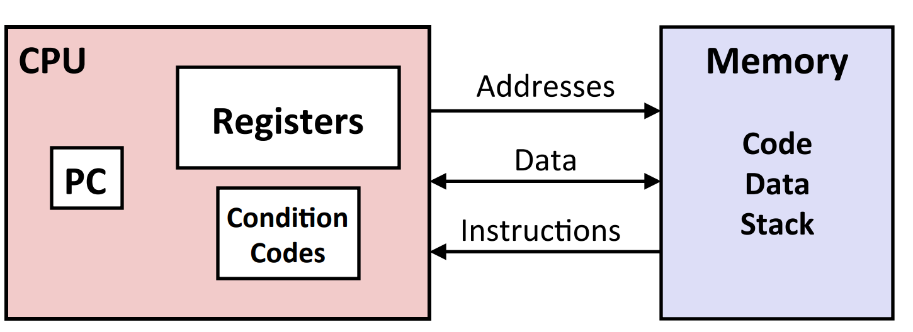
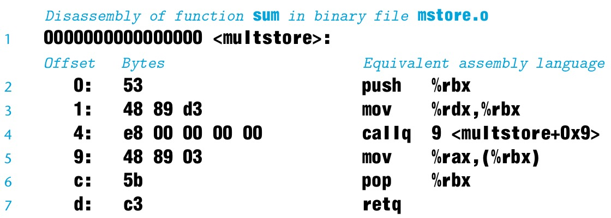
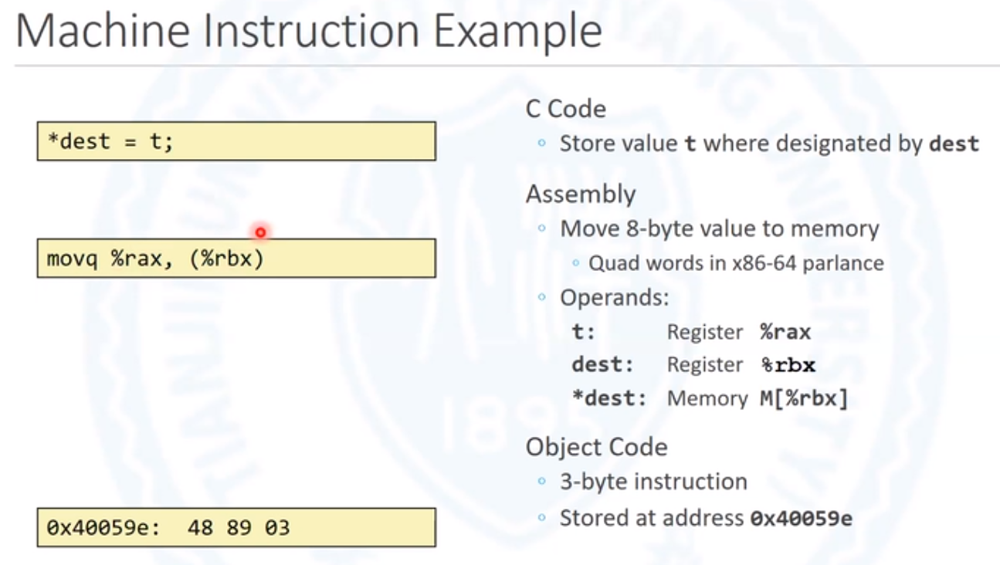
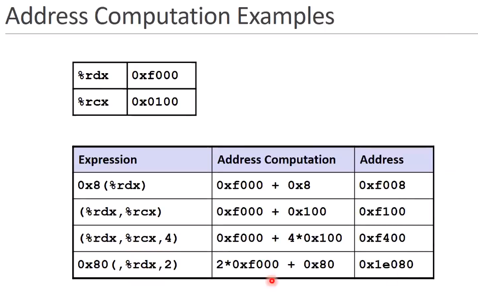
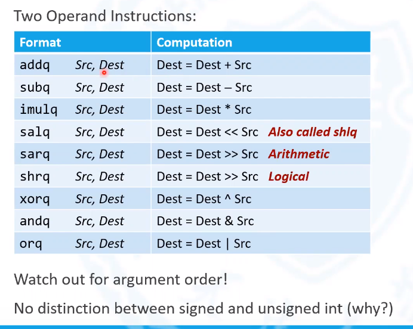
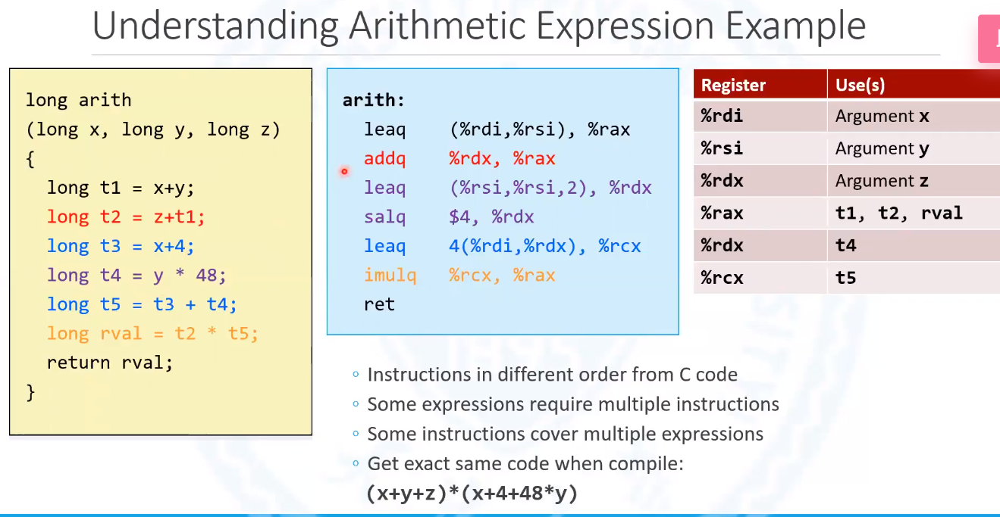

# 程序的机器级别表示：基础

<!-- more -->

该章开始就是**整本书，整个课程的真正核心部分**，我们将深入学习机器级别编程，关心计算机为了运行我们的程序，所执行的一串独立的指令。**以汇编语言为媒介，去理解高级语言的种种行为。**

实际上有两种形式的机器程序，一个是在计算机上运行的实际目标代码，它们是一串字节，编码处理器执行的指令。由于实际目标代码难以理解，我们利用汇编代码等去理解其含义，这是没有问题的，因为汇编代码与实际目标代码有一对一的映射关系。不同于以前程序员们直接编写汇编代码，现在汇编代码的生成由编译器负责.

但是汇编语言仍然对程序员来说至关重要，作为一个桥梁，它将你的程序和这些代码实际在机器上运行的形式连接起来——汇编代码就是它们的中间形式。该课程不会写很多的汇编代码，取而代之的是阅读由C语言编译器GCC生成的汇编语言，理解编译器产生结果与输入它的内容的联系。

**本课程针对是英特尔64位版本的指令集（`x86-64`）**

## 3.1 历史展望

### Inter x86 Processors

x86对于英特尔处理器来说是一个口头的称谓，因为第一个芯片被称为8086，随后推出了8286，8386等等，共同点是都有86，所有人们只称它为x86。

x86有时汇编称为`CISC`(`Complex Instruction Set Computer`), 即复杂指令集.

## 3.2 程序编码

假设我们把一个C程序写成两个文件`p1.c`和`p2.c`。我们可以用一条`Unix`命令（`Linux`系统下）来编译它们。

```shell
linux> gcc -Og -o p p1.c p2.c
```

`gcc`命令代表的是C语言编译器`GCC`，`-Og`选项指示编译器应用某种程度的优化，从而产生遵循原始C代码的整体结构且更易于理解的机器代码。调用更高层次的优化，会提高程序的运行效率，但会使得生成的机器代码更加难以理解。

`gcc`命令调用整个程序序列，将源代码转换为可执行代码。首先，C语言预处理器（`preprocessor`）对源代码进行拓展，包括`#include`命令指定的任何文件（通常为头文件如`stdio.h`和`#define`声明指定的任何宏定义。)`.c`后缀文件经过预处理器后得到`.i`后缀文件，如这里会产生`p1.i`和`p2.i`文件。`.i`后缀文件仍然是文本文件。第二步，编译器(`complier`）将`.i`后缀文件翻译为`.s`后缀文件，它们是源文件的汇编码版本。之后，汇编程序（`assembler`）将汇编码转换为二进制机器码文件`p1.o`和`p2.o`。此时`p1.o`和`p2.0`虽然是二进制文件，但是还不能执行。最后，链接器（`linker`）将这两个二进制机器码文件和实现库函数的代码（例如`printf`）合并，并生成可执行代码文件`p`（由命令行指令`-o p`所确定）。

流程图如下


### 3.2.1机器级代码

计算机系统采用了几种不同的抽象形式，通过使用了更简单的抽象模型来隐藏实现的细节。其中两个对机器级别的编程来说十分重要。

第一个是机器级程序的格式和行为是由指令集结构（`instruction set architecture ` or `ISA`)定义的。大部分的指令集，包括`x86-64`，描述程序的行为，就好像程序是按顺序执行的，每条指令都是在前一个指令结束时开始。而真实情况是，处理器硬件要复杂的多，它们会同时执行许多指令，同时也采用了保障措施，以确保整体行为符合指令集规定的顺序。

第二，在机器级程序中使用的内存地址被称做”虚拟地址“（`visual addresses`）。它提供了看上去像一个巨大的字节数组的内存模型。而内存系统的真实运行模式包含了硬件的多重内存结构和操作系统软件。这会在`CS:APP`第九章中展开具体讨论。

编译器大部分的工作都是完全遵循编译顺序的，它将表达在由C语言提供的相对抽象（对机器而言）的运行模型中的程序转换为处理器能够执行的非常基础的指令。而汇编代码在表达上非常接近机器码。相对于机器码中的二进制形式，汇编码采用是一种更可读的文本形式。**理解汇编代码本身以及它和最初的C语言代码的联系**是深入理解计算机执行程序的关键步骤。

`x86-64`指令集的机器码与最初的C语言代码差别很大。处理器的状态对于C程序员来说通常是隐藏的，仅有部分状态时可见的

+ 程序计数器（`program counter` or `PC`, 在`x86-64`指令集下被称为`%rip`寄存器)存储下一条要执行的指令在内存中的地址。

+ 寄存器文件包含16个用来存储64位值的已命名区域。这些寄存器能够存储地址（对应与C语言中的指针）或者整数数据。一些寄存器被用来记载程序状态的关键部分，其他则用来容纳暂存数据。

+ 条件代码寄存器保存最近执行的算术或逻辑指令的状态信息。它们是用来实现数据流中的条件变化，在实现`if`和`while`表达式的操作中，它们是必不可少的。

+ 向量寄存器能容纳一个或多个整数或者浮点数。

  x86-64架构寄存器一览
  
  

机器代码将内存简单的看作一个巨大的可寻址字节数组。C语言中的数据类型，无论是单个数据类型还是聚合数据类型（如`array`和`struct`），标量还是向量数据类型，无符号还是有符号数据类型，在机器代码看来都是单个字节或者字节的集合。

程序所需要的内存，包括对应的可执行机器代码，一些操作系统所需要的信息，一个用于管理过程调用和返回的运行时间堆和用户自主分配的内存空间（比如用`malloc`函数申请的内存空间）。正如前面所提到的，程序内存使用虚拟地址来寻址。在任意给定的时间里，只有虚拟内存中限定的子范围才是有效的。例如，`x86-64`虚拟地址用64位表示。在64位机器目前的实施来看，前面的16位必须设置成0，这样做才有可能在`64TB`范围内指定一个字节。



操作系统管理这些虚拟地址空间，将虚拟地址翻译为在真正的处理器内存中值的物理内存。

一个单一的机器指令，只能执行一个非常基础的操作。编译器必须要产生这些指令的序列去实现程序的种种功能。

### 3.2.2 代码示例

```C
long mult2(long, long);

void multstore(long x, long y, long *dest){
    long t = mult(x, y);
    *dest = t
}
```

我们在命令行中用`-S`来查看由C语言编译器产生的汇编代码。

```shell
linux> gcc -Og -S mstore.c
```

GCC编译器运行，产生汇编文件`mstore.s`后不再继续执行下一步操作。

汇编文件会包含各种各样的声明，包括以下几行。

```assembly
multstore:
	pushq %rbx
	movq %rdx, %rbx
	call mult2
	movq %rax, (%rbx)
	popq %rbx
	ret
```

在代码中每个缩进行都对应一条机器指令。比如说`pushq`表明寄存器中的内容`%rbx`应该被推送到程序栈中。所有关于本地变量名或数据类型的信息都已被删除。

如果我们用`-c`命令，GCC会编译+处理代码。

```shell
linux> gcc -Og -c mstore.c
```

这会产生二进制格式文件`mstore.o`，因此不能被直接查看。在`mstore.o`文件1,368字节的文件中有这样的一个14字节的十六进制文字序列

```shell
53 48 89 d3 e8 00 00 00 00 48 89 03 5b c3
```

这些代码对应于前面列出的汇编指令。从中我们得出，**机器执行的程序只是一个编码一系列指令的字节序列。**机器对源代码几乎一无所知。

为了看到机器代码文件的内容，我们需要用到一类名为**反编译器**（`disassemblers`的程序。这些程序从机器代码中生成类似于汇编的格式。`Linux`系统中的`OBJDUMP`能实现这一功能。

```shell
liunx> objdump -d mstore.o
```

反编译结果如下图所示

一些机器代码和它的反编译表示的特征值得说明一下

+ `x86-64`指令长度为1到15个字节。指令编码的设计使常用的指令和操作数较少的指令比不常用的指令或操作数较多的指令所需的字节数更少。

+ 指令格式的设计使是这样的，从一个给定的起始位置开始，有一个唯一的字节解码成机器指令。例如，只有指令`pushq %rbx`可以从字节值53开始。

+ 反编译程序纯粹根据机器码文件中的字节序列来确定汇编代码。它不需要访问程序的源代码或汇编码版本。

+ 反编译程序对指令使用了与gcc生成的汇编代码稍有不同的命名方式。

  产生实际可运行代码需要在对象代码文件集上运行一个链接器。这些对象代码文件中必须包含主函数`main`。

  假设在文件`main.c`中有如下代码

  ```c
  #include <stdio.h>
  
  void multstore(long, long, long *);
  
  int main(){
      long d;
      multstore(2, 3, &d);
      printf("2 * 3 --> %ld\n", d);
      return 0;
  }
  
  long mult2(long a, long b){
      long s = a * b;
      return s;
  }
  ```

  在`Linux`命令行中，我们用如下的命令就可以生成可执行文件`prog`

  ```shell
  linux> gccc -Og -o prog main.c mstore.c
  ```

  `prog`文件增长到8,655个字节，因为它不仅包含了我们为该过程提供的机器码，还有用来与操作系统互动，开始和终止这段代码的程序。

  我们来反编译下`prog`文件。

  ```shell
  linux> objdump -d prog
  ```

  反编译器会提取各种代码序列，包含以下内容。

.JPG)

这个代码与之前`mstore.c`文件反编译得到的几乎一致。

`mstore.c`反编译结果（部分）



一个重要的不同是在左边列出的地址不同。链接器已将该代码的位置转移到不同的地址范围。第二个不同是链接器已经填好了调用函数`mult2`时`callq`指令应该使用的地址。链接器的任务之一用为函数调用匹配这些函数可执行代码的位置。最后一个不同是我们会在前一个反编译结果中看到两行额外的代码（代码行8，9）。尽管它们出现在return 指令的后面，但是实际上对程序没有任何影响。它们的作用是占位，使代码到达16个字节的长度，使下一段代码在内存系统性能上有更好的放置位置。

机器指令例子



### 3.2.3 汇编语言格式

本课程采用的是`AT&T`格式汇编语言。格式为：


标号是可选的，标号用来显示右边的指令在内存中的位置，不会生成机器指令。

操作码是必选的，操作码用来说明当前指令所进行的行为，例如加减乘除等算术运算。

操作数的个数可以是0个，1个或者两个，两个操作书之间用逗号分隔。操作数的作用是说明当前指令所操作的数据对象。控制指令等不需要操作数。操作数1是源操作数，操作数2是目标操作数。

带解释的汇编语言程序

```assembly
void multstore(long x, long y, long *dest)
 // x in %rdi, y in %rsi, dest in %rdx
 multstore:
	pushq %rbx					# Save %rbx
	moveq %rdx, %rbx			# Copy dest to %rbx
	call mult2					# Call mult(x, y)
	movq %rax, (%rbx)			# Store result at *dest
	popq %rbx					# Restore %rbx
	ret 						# return
```

## 3.3 数据格式

由于历史上曾经从16位结构转换到32位架构，Intel用“word”指16字节的数据类型。因此32位数据类型被乘坐“double words”，以此类推。

.JPG)

<center>x86-64指令集中C语言数据类型的大小</center>

操作码后必须跟上前缀(`Assembly-code suffix`), 使用什么数据类型，后面的操作数就必须跟该数据类型一样的位数的寄存器。

## 3.4 访问信息

一个x86-64指令集下的CPU包含一组16个存储64位值的通用寄存器(`general-purpose register`)。这些寄存器用来存储整数和指针数据。它们的名字以`%r`开头，但是由于历史原因，之后的名称命令规则就不同了。.JPG)

<center> 处理器中的16个寄存器</center>


最初的8086处理器有8个16位寄存器，即从`%ax`到`%bq`。

随着32位的拓展，寄存器扩充到了32位，即图中从`%eax`到`%ebq`。

之后有拓展到了64位，于是寄存器扩充到了64位，即图中从`%rax`到`%rbq`。此外，8个新的寄存器也被添加进来，它们有了新的命名规则，即从`%r8`到`%r15`。

汇编语言操作这些寄存器的时候，是以这些寄存器的名称作为操作数进行操作的。 

对于这些寄存器的低32位，在汇编语言中可以使用特殊的名称进行直接访问。对于`%rax`到`%rbq`，是以`%eax`到`%ebq`进行访问，对于`%r8`到`%r15`，是以`%r8d`到`%15d`进行访问的。

不同的寄存器在程序中担任不同的角色。

其中最特殊的是栈指针，即`%rsp`， 用来存放栈顶指针。

### 3.4.1 操作数指示符

### 数据访问指令

#### Moving data

```assembly
movq Source, Dest		# 移动64位数据
```

##### 操作数种类

1.  立即数(`Immediate`)

   通常是一个为常数的整数类型，例如 `$0x400`, `$-533`。

   与C语言常数类似，但额外添加了`$`前缀。

   有1, 2, 4和8字节三种编码方式，具体取决于操作码的最后一个字母，该字母用来描述该次操作所涉及的数据位长。

2. 寄存器(Register)

   16个通用寄存器都可以作为操作数

   例如：`%rax`, `%r13`

   `%rsp`有特殊用途，用于存放栈顶数据地址。

3. 内存(`Memory`)

   move指令可以通过访问内存中某个地址，从内存中加载数据或者存放数据。

   例如：(%rax) 用来描述 （）里存放的数据实际上是一个地址,加上括号，就是去访问`%rax`所在地址的数据。

##### move指令组合


##### move指令实例


`ret`代表是C语言中的过程返回操作，类似`return`。

函数调用前


函数调用后


#### 完全内存寻址模式

在x86汇编指令中，内存寻址是十分灵活的。


D(R~b~, R~i~, S) 四元组

D: 基于内存地址的偏移量，有符号数.是1，2，4，8字节的一个常数。

R~b~：表示内存的基地址：可以是所有的16个寄存器。

R~i~:  索引寄存器：除了`%rsp`，其他寄存器都能表示R~i~。

S:  表示大小。1，2，4，8中的一个. 因为高级语言处理数据类型时，基本数据类型的宽度只有1，2，4，8字节。

Mem[Reg[R~b~]+S×Reg[R~i~]+D]: R~b~寄存器中的值 + R~i~寄存器中的值×S + D，**运算值作为实际内存的访问地址。**

特例：

1. 某些元素可以不出现在表达式中，如

   (R~b~, R~i~)				Mem[ Reg[R~b~] + Reg[R~i~] ] 此时 D = 0， S = 1

   D(R~b~, R~i~)				Mem[ Reg[R~b~] + Reg[R~i~] + D] 此时  S = 1

   (R~b~, R~i~, S)				Mem[ Reg[R~b~] + S * Reg[R~i~] ] 此时 D = 0

**实例**



采用完全内存寻址模式，不是将最后代表”Address“的数值赋值给目标操作数。而是将这个地址所指向的内存中的数据赋值给内存操作数。

### 算术运算指令

#### 地址运算指令

```assembly
leaq Src, Dst			# lea为操作码，q为后缀
```

Src, 源操作数，通常是一个类似于寻址模式的四元组，类似于D(R~b~, R~i~， S)。四元组用来进行地址表达式的计算。

Dst，目标操作数，通常是一个寄存器，用来存放算术运算的地址的结果。

地址运算指令用来运算无内存引用的地址计算

比如 p = &x[i]。计算数组x的下标为i的元素所在索引的地址并赋值给指针p。是直接赋值地址。**lea指令不会对内存进行任何访问。** 

计算方法： 算出x的基地址，在算出x中每个元素的大小并乘以下标i得到最后的位置。


%rdi寄存器用来存放传入的long x，

此外，lea指令也可以用作算术运算。

### 3.5.2 双操作数

**一些算术操作指令**



目标操作数只能是内存或者寄存器，不能是立即数。源操作数三者都可以。

为什么不区分无符号和有符号整数运算？

加法运算对二者在位级别上的运算一致，乘法减法也是如此

除法运算分为有符号数除法和无符号数除法。

### 3.5.3 单运算操作数


实例



在汇编语言中，由`rax`寄存器存储最终的返回值。并由`ret`指令返回。

从中我们发现的现象：

1. 指令和C语言源代码的顺序可能不同。
2. 一些表达式需要多个指令去完成。
3. 一些指令可以包含多个表达式。

  4.局部（临时）变量不一定要在内存中存储。声明了变量也不一定浪费内存。因为将变量放在寄存器中运算速度远远大于将变量放在内存中，编译器会优先把局部变量放在寄存器中。因此，多用局部变量或者表达式不一定会增加程序运行时间。

### 3.5.5 逻辑运算示例

在x86-64处理器上，如果运行一个32位指令，意味着最后操作的目标寄存器的高32位会被清0。

