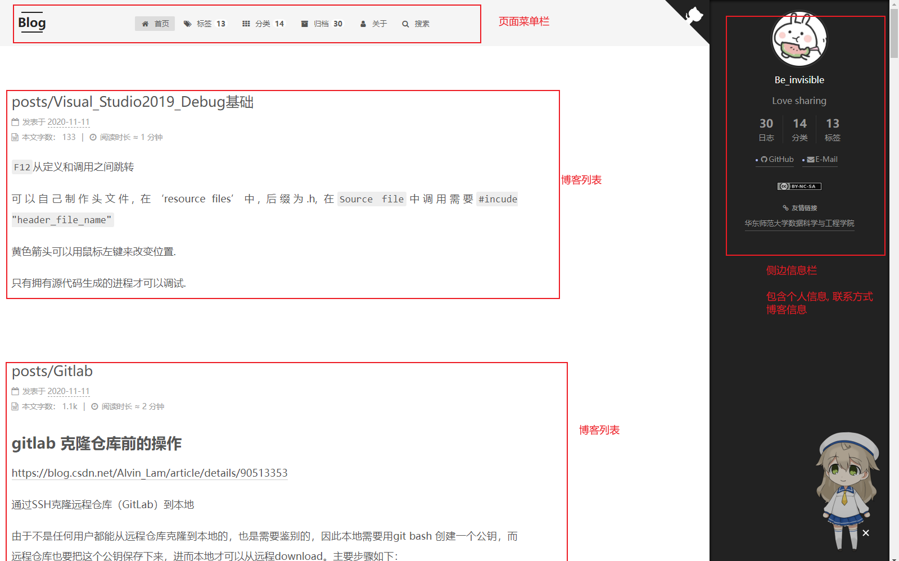
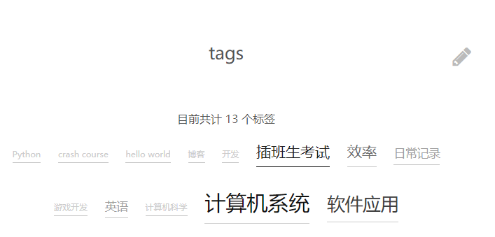
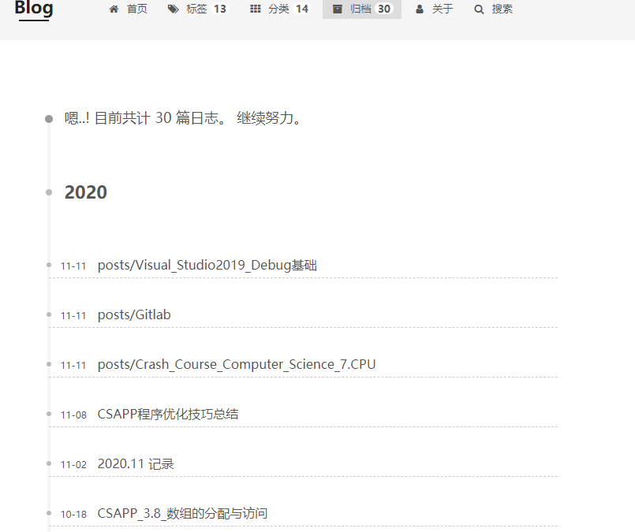
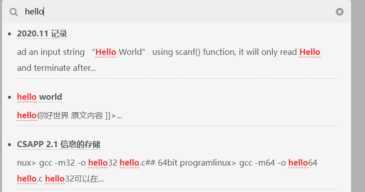

# Hexo + Github Pages博客配置总结

# 博客主题及其选择原因

我是在三年前， 也就是大一入学不久就建立了我的这个博客（https://zhangchunxian.github.io/），当时我看了一些本校学长的博客，建立Hexo博客也是受到了Godweiyang学长的这篇博客的影响。（ https://godweiyang.com/2018/04/13/hexo-blog/）。 在这篇文章中Godweiyang就是使用Hexo框架配置的个人博客。 

至于Hexo与github pages的好处, 比起自己搭建博客，这两个结合在一起可以省去购买域名和服务器的成本，不需要考虑定期维护，对于不使用全栈的人（比如我），非常省力

为什么选择Hexo框架的next主题呢? 主要是因为在翻阅Hexo主题时, 最中意的就是这篇博客(https://blog.ahao.moe/)的样式了, 里面使用的样式就是next, 所以我就选择了next主题.

# 博客页面及其设计思路

博客页面布局如下:

+ 页面菜单栏: 包含主页, 标签, 分类, 归档, 关于, 搜索等选项
+ 页面菜单栏: 包含个人联系方式, 博客信息, 友情链接等信息.
+ 内容栏: 包含最近发布的缩略的博客文章.




# 博客功能实现及其技术选择

Hexo + github的搭建网上已经有很多文档了, 简单来说可以分为三步

+ 在github上建立公开仓库, 名字必须为  自己的Github用户名.github.io, readme初始化的选项也要选择.

+ 在本地安装npm包hexo-deployer-git, 使用`hexo new post "article title"` 新建一篇文章, 在source/_posts/文件夹下会看到新建的.md文件, 在md文件里面编辑即可.

+ 编写完markdown文件后，根目录下输入`hexo g`生成静态网页，然后输入`hexo s`可以本地预览效果，最后输入`hexo d`上传到github上。这时打开你的github.io主页就能看到发布的文章啦.

  

## 选择markdown作为编辑语言

博客渲染本质上是将markdown转化为html渲染在静态页面上.

Markdown是一种轻量级的标记语言, 非常简单易学. Markdown其实就是用一些简单符号来起到排版作用，因为纯键盘操作，写作时少调用鼠标，效率能提升很多，不必多花时间在排版上。对于博客来说, 写作本身就是最重要的.

# 博客样式及其美学考量

## 文章的分类与整理

每个博客文章都有对应的时间, 标签, 分类. 

- 在菜单栏点击标签页面可以根据标签查看博客
  - 
- 在菜单栏点击归档, 可以按照时间顺序查看博客.
  - 
- 在菜单来点击分类, 可以按照分类查看博客.
  - 

最后, 可以根据文字内容搜索博客相关内容.



# 博客制作过程中遇到的问题及其解决方法

## 问题1 Failed to connect to github.com port 443:connection timed out

这个问题可能是因为在本地使用了代理, 我们使用git取消代理一般就可以解决问题

```bash
取消全局代理：
git config --global --unset http.proxy
 
git config --global --unset https.proxy
```

## 问题2 推送新文章到博客后还需要手动重新生成Github pages

这个问题说小不小, 每当我们辛苦写完一篇博客文章后, 推送到github上, 万一忘记了重新部署Hexo静态页面. 我们写完的文章是不会出现在博客网页上的

这里的解决方案是使用Travis CI（持续集成）

Travis CI（持续集成）是一个在软件开发过程中提供自动化构建、测试和部署的在线平台。它与GitHub等代码托管服务紧密集成，可以轻松地为您的项目设置持续集成流程。

我们只需要以下步骤:

- 配置文件：需要在项目的根目录下创建一个名为`.travis.yml`的配置文件，该文件用于定义构建和测试的步骤。
- 触发构建：每当您向代码库提交新的更改或推送到GitHub仓库时，Travis CI将自动检测到这些更改，并触发构建过程。

因为Travis CI灵活的配置和能够自动化部署的特性, 我们只需要配置好Travis CI后直接push文章就可以了.

travis.yml内容如下:

```yml
# 使用语言
language: node_js
# node版本
node_js:
  - 10
# 设置只监听哪个分支
branches:
  only:
    - source
# 缓存，可以节省集成的时间，这里我用了yarn，如果不用可以删除
cache:
  apt: true
  yarn: true
  directories:
    - node_modules
    - theme
before_install:
  #  配置git
  - git config --global user.name "ZhangChunXian"
  - git config --global user.email "1836891291@qq.com"
  # 由于使用了yarn，所以需要下载，如不用yarn这两行可以删除
  - curl -o- -L https://yarnpkg.com/install.sh | bash
  - export PATH=$HOME/.yarn/bin:$PATH
  # npm模块安装
  - yarn global add hexo-cli
  # - yarn remove hexo-renderer-marked
  - yarn add hexo-renderer-kramed
  - yarn add hexo-asset-image
  - yarn add hexo-generator-searchdb
  - yarn add hexo-generator-feed
  #- yarn add hexo-related-popular-posts
  - yarn add hexo-symbols-count-time
  - yarn add hexo-generator-sitemap
  - yarn add hexo-generator-baidu-sitemap
  - yarn add hexo-deployer-git
  - yarn add hexo-helper-live2d
  - yarn add theme-next/next-util

  # 将 GitHub Token 替换到 next.yml 中
  - sed -i "s/REPO_TOKEN/${REPO_TOKEN}/" source/_data/next.yml
  # next主题下载
  - git clone https://github.com/theme-next/hexo-theme-next themes/next
  - cd themes/next && git checkout v7.7.2 && cd -
  # next主题依赖下载
  - git clone https://github.com/theme-next/theme-next-pdf themes/next/source/lib/pdf
  - git clone https://github.com/theme-next/theme-next-pace themes/next/source/lib/pace
install:
  # 不用yarn的话这里改成 npm i 即可
  - yarn
script:
  - hexo clean --config source/_data/next.yml
  - hexo g --config source/_data/next.yml
  - hexo d --config source/_data/next.yml
```

